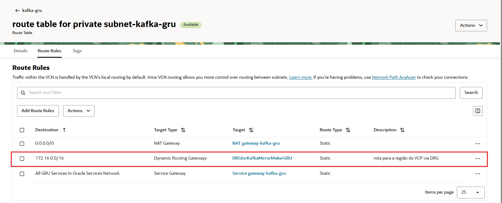

# Streaming and Managed Kafka

> **IMPORTANT**: This blog is designed solely for educational and study purposes. It provides an environment for learners to experiment and gain practical experience in a controlled setting. It is crucial to note that the security configurations and practices employed in this lab might not be suitable for real-world scenarios.
Security considerations for real-world applications are often far more complex and dynamic. Therefore, before implementing any of the techniques or configurations demonstrated here in a production environment, it is essential to conduct a comprehensive security assessment and review. This review should encompass all aspects of security, including access control, encryption, monitoring, and compliance, to ensure that the system aligns with the organization's security policies and standards.
Security should always be a top priority when transitioning from a lab environment to a real-world deployment.

# Summary

- **General**
  - [x] Remove sensitive content, using properties file
  - [x] Review best practices, such as storing security artifacts in vault or bucket

- **Streaming**
  - [x] Producer and Consumer using Java and Python
  - [x] After I configured to use more recent versions of the Kafka libraries in the project, it was necessary to define the parameter [enable.idempotence=false] in the properties of the class that produces the messages, because this error was occurring: *org.apache.kafka.common.errors.UnsupportedVersionException: The broker does not support INIT_PRODUCER_ID*

- **Kafka**
  - [x] SASL-SCRAM Producer and Consumer using Java and Python
  - [x] mTLS Producer and Consumer
  - [x] Use Kafka **super user** and setup ACLs (topics, users and permissions between artifacts)
  - [x] Plug in a graphical interface to manage the environment
  - [x] Tests with Mirror Maker and how to configure your network to connect different OCI Regions
  - [x] Schema Registry not yet native, but we can use an open source one (in this case, we use Apicurio). Managed Schema Registry is on the roadmap for FY27.
  - [x] The use of the Kafka server **FQDN is mandatory** for connection:
    - This is the error when we try to use the server IP via **mTLS**: *ERROR: [Producer clientId=producer-1] Connection to node -1 (/10.0.1.238:9093) failed authentication due to: SSL handshake failed*
    - This is the error when we try to use the server IP via **SASL-SSL**: *ERROR: [Producer clientId=producer-1] Connection to node -1 (private-nlb-c1-btaxq3z9d0ziwk0g.sub11252107191.kafkagru.oraclevcn.com/10.0.1.238:9092) failed authentication due to: SSL handshake failed*
  - [x] Describe security items in more detail, especially about the use of **mTLS** and **Certification Authority** in OCI Services, providing Customer´s certificates signed by Oracle CA (recommended for Production Environments).
  - [x] Testing with Kafka Connect
  - [x] Testing and Considerations on Performance
  - [x] Testing Kafka Rest Proxy

**Directory Structure**

```
    .
    ├── config (not commited for security reasons)
    │   ├── kafka-mtls-consumer.properties
    │   ├── kafka-mtls-producer.properties
    │   ├── kafka-sasl-ssl-avro-consumer.properties
    │   ├── kafka-sasl-ssl-avro-producer.properties
    │   ├── kafka-sasl-ssl-consumer.properties
    │   ├── kafka-sasl-ssl-producer.properties
    │   ├── streaming-consumer.properties
    │   └── streaming-producer.properties
    ├── docs
    │   └── Parte 2 - Highly Protected Architecture with mTLS + LB + WAF + API GW + JWT.pdf
    ├── images
    │   ├── 00_KafkaMirrorMakerSetup.png
    │   ├── 00_ManagedKafka.png
    │   ├── 01_endpointsGRU.png
    │   ├── 02_ruleGRU.png
    │   ├── 03_endpointsVCP.png
    │   ├── 04_ruleVCP.png
    │   ├── 05_routeTableGRU.png
    │   ├── 06_routeTableVCP.png
    │   ├── 07_securityListGRU.png
    │   ├── 08_securityListVCP.png
    │   ├── 09_apicurioUI.png
    │   ├── 10_schemaRegistryAvroDetail.png
    │   ├── 11_CAmTLSandCertificates.png
    │   ├── 12_Fluxo_mTSL_with_OCI_CertitificateAuthority.png
    │   ├── 13_CreatingMasterKeyCopyPublicWrappingKey.png
    │   ├── 14_CreatingMasterKeyPart01.png
    │   ├── 15_CreatingMasterKeyPart02.png
    │   ├── 16_CreatingCA_step01.png
    │   ├── 17_CreatingCA-step02.png
    │   ├── 18_CreatingCA-step03.png
    │   ├── 19_CreatingCA-step04.png
    │   ├── 20_CreatingCA-step05.png
    │   ├── 21_CreatingCA-step06.png
    │   ├── 22_CA_ClientCertificate01.png
    │   ├── 23_CertificateCreation-step01.png
    │   ├── 24_CertificateCreation-step02.png
    │   ├── 25_CertificateCreation-step03.png
    │   ├── 26_CertificateCreation-step04.png
    │   ├── 27_CertificateCreation-step05.png
    │   ├── 28_CA_CertificateViewContent.png
    │   ├── 29_CA_CertificateDonwload.png
    │   ├── 30_ClientCertificateViewContent.png
    │   ├── 31_ClienteCertificateDownload.png
    │   └── 32_GrafanaK6KafkaPerformance.png
    ├── k6
    │   └── test_sasl_auth.js
    ├── pom.xml
    ├── README.md
    ├── sql
    │   └── 00_script_banco_dados.sql
    ├── src
    │   ├── main
    │   │   ├── avro
    │   │   │   └── user.avsc
    │   │   └── java
    │   │       └── com
    │   │           └── oracle
    │   │               ├── avro
    │   │               │   └── User.java
    │   │               ├── KafkaMtlsConsumer.java
    │   │               ├── KafkaMtlsProducer.java
    │   │               ├── KafkaSASL_SSL_AvroConsumer.java
    │   │               ├── KafkaSASL_SSL_AvroProducer.java
    │   │               ├── KafkaSASL_SSLConsumer.java
    │   │               ├── KafkaSASL_SSLProducer.java
    │   │               ├── StreamingConsumer.java
    │   │               ├── StreamingProducer.java
    │   │               └── util
    │   │                   ├── Environments.java
    │   │                   ├── OracleTest.java
    │   │                   └── PropertiesUtil.java
    │   └── test
    │       └── java
    │           └── com
    │               └── oracle
    │                   └── AppTest.java
    └── target
```

# Streaming

**Exemplos em Java para consumir e produzir mensagens com Streaming:**

Os arquivos abaixo são exemplos criados e seus arquivos de propriedades utilizados:

 - StreamingProducer.java e arquivo: streaming-producer.properties

    ```
    bootstrap.servers=cell-1.streaming.sa-saopaulo-1.oci.oraclecloud.com:9092
    security.protocol=SASL_SSL
    sasl.mechanism=PLAIN
    sasl.jaas.config=org.apache.kafka.common.security.plain.PlainLoginModule required username="tenancyName/YourDomainOrNotTestIt/username/ocid1.streampool.oc1.sa-saopaulo-1." password="yourAuthToken";
    key.serializer=org.apache.kafka.common.serialization.StringSerializer
    value.serializer=org.apache.kafka.common.serialization.StringSerializer
    #retries on transient errors and load balancing disconnections
    retries=3
    #limit request size to 1MB = 1024 x 1024
    max.request.size=1048576
    #need to set this to false, because [Idempotent production] are not yet implemented in the Streaming service
    #reference: https://docs.oracle.com/en-us/iaas/Content/Streaming/Tasks/kafkacompatibility.htm
    enable.idempotence=false
    acks=all
    ```

 - StreamingConsumer.java e streaming-consumer.properties:

    ```
    bootstrap.servers=cell-1.streaming.sa-saopaulo-1.oci.oraclecloud.com:9092
    security.protocol=SASL_SSL
    sasl.mechanism=PLAIN
    sasl.jaas.config=org.apache.kafka.common.security.plain.PlainLoginModule required username="tenancy/YourDomainOrNotTestIt/user/ocid1.streampool.oc1.sa-saopaulo-1." password="yourAuthToken";
    group.id=group-java
    enable.auto.commit=true
    auto.commit.interval.ms=1000
    session.timeout.ms=30000
    key.deserializer=org.apache.kafka.common.serialization.StringDeserializer
    value.deserializer=org.apache.kafka.common.serialization.StringDeserializer
    #limit request size to 1MB per partition = = 1024 x 1024
    max.partition.fetch.bytes=1048576
    ```
 
 - Exemplos de como produzir e consumir mensagens do Streaming usando os binários do Kafka (mais adiante teremos detalhes de como realizar a instalação e configuração destes binários):

    ```
    #arquivo streaming.properties
    security.protocol=SASL_SSL
    sasl.mechanism=PLAIN
    sasl.jaas.config=org.apache.kafka.common.security.plain.PlainLoginModule required username='tenancy/YourDomainOrNotTestIt/user/ocid1.streampool.oc1.sa-saopaulo-1.' password='yourAuthToken';
    enable.idempotence=false

    #produzir mensagem
    kafka-console-producer.sh \
    --bootstrap-server cell-1.streaming.sa-saopaulo-1.oci.oraclecloud.com:9092 \
    --topic chafikStream \
    --producer.config streaming.properties

    #consumir mensagem
    kafka-console-consumer.sh \
    --bootstrap-server cell-1.streaming.sa-saopaulo-1.oci.oraclecloud.com:9092 \
    --topic chafikStream --from-beginning \
    --consumer.config streaming.properties    
    ```

**Referências sobre Streaming:**
  - [Início Rápido do Kafka Java Client e do Serviço Streaming](https://docs.oracle.com/pt-br/iaas/Content/Streaming/Tasks/streaming-kafka-java-client-quickstart.htm#kafka-java-quickstart)
  - [Using Streaming with Apache Kafka](https://docs.oracle.com/en-us/iaas/Content/Streaming/Tasks/kafkacompatibility.htm)


# Kafka


**Documentação:**
  - [Streaming with Apache Kafka](https://docs.oracle.com/en-us/iaas/Content/kafka/home.htm)

**Policy on behalf of Customer to Rawfka( MUST )**
```
Allow service rawfka to use vnics in compartment <compartment>
Allow service rawfka to use network-security-groups in compartment <compartment>
Allow service rawfka to use subnets in compartment <compartment>
```
 
**To enable SASL super user**
```
Allow service rawfka to {SECRET_UPDATE } in compartment <compartment>
Allow service rawfka to use secrets in compartment <compartment> where request.operation = 'UpdateSecret'
```

**Criar o arquivo kafka.json com o seguinte conteúdo, para ser utilizado na criação da configuração do cluster kafka**
```
{
    "properties": {
        "num.network.threads": 3,
        "num.io.threads": 8,
        "socket.send.buffer.bytes": 102400,
        "socket.receive.buffer.bytes": 102400,
        "socket.request.max.bytes": 104857600,
        "log.retention.hours": 168,
        "log.segment.bytes": 1073741824,
        "log.retention.check.interval.ms": 300000,
        "num.partitions": 1,
        "default.replication.factor": 1,
        "min.insync.replicas": 1,
        "message.max.bytes": 1000012,
        "replica.fetch.max.bytes": 1048576,
        "offsets.topic.replication.factor": 1,
        "transaction.state.log.replication.factor": 1,
        "transaction.state.log.min.isr": 2
    }
}
```

**Comando para criar o cluster config, baseado no arquivo gerado anteriormente**
```
oci kafka cluster-config create \
-c ocid1.compartment.oc1.xxx \
--latest-config file://kafka.json \
--region sa-vinhedo-1
```

**Criar o cluster kafka**

>Importante: a subnet para provisionar o cluster deverá ser **privada**

```
oci kafka cluster create \
--access-subnets '[{"subnets": ["ocid1.subnet.oc1.sa-vinhedo-1.xxx"]}]' \
--cluster-config-id ocid1.kafkaclusterconfig.oc1.sa-vinhedo-1.xxx \
--cluster-config-version 1 \
--cluster-type PRODUCTION \
--coordination-type ZOOKEEPER \
--broker-shape '{"nodeCount": 3, "ocpuCount": 4, "storageSizeInGbs": 100 }' \
--kafka-version 3.7.0 \
--compartment-id ocid1.compartment.oc1..xxx \
--region sa-vinhedo-1
```

**Habilitar o Super User para utilizar com SASL_SSL**

  >Primeiro deverá ser criado um vault e um secret do tipo **Manual secret generation**. Utilizar o ocid do secret, para executar o comando ou via console, clicando no botão **Update SALS SCRAM** que fica no Kafka Cluster, e associar o Vault e o Secret criado.

```
oci kafka cluster enable-superuser \
--kafka-cluster-id ocid1.kafkacluster.oc1.sa-vinhedo-1.xxx \
--compartment-id ocid1.compartment.oc1..xxx \
--secret-id ocid1.vaultsecret.oc1.sa-vinhedo-1.xxx \
--region sa-vinhedo-1
```

  >Após finalizar a execução, dentro do secret estará o usuário e senha do super user.

# Preparando os itens que serão necessário para acessar e configurar o kafka cluster após sua criação

**generate a CA key**

Gerar uma chave privada RSA protegida por senha com criptografia AES-256.
Esse comando é usado para criar uma chave privada que pode ser usada para assinar certificados digitais.
Comumente utilizado em infraestruturas de chave pública (PKI) para criar uma Autoridade Certificadora (CA).
```
openssl genpkey -algorithm RSA -out rootCA.key -aes256 -pass pass:yourpassword -pkeyopt rsa_keygen_bits:4096
```

**generate CA self signed cert:**

Esse comando cria um certificado autoassinado no formato X.509, usando a chave privada gerada anteriormente (rootCA.key). Ele é usado para configurar uma Autoridade Certificadora (CA).
Esse certificado rootCA.pem pode ser usado como Autoridade Certificadora (CA) para assinar certificados de outros servidores e dispositivos.
É útil para criar uma infraestrutura de certificação privada, por exemplo, em empresas, VPNs ou redes internas.
Pode ser instalado em clientes para que reconheçam certificados assinados por essa CA como confiáveis.
```
openssl req -x509 -new -nodes -key rootCA.key -sha256 -days 3650 -out rootCA.pem -passin pass:yourpassword
```

**create leaf cert private key and csr(cert signed request):**

Esse comando gera uma chave privada RSA de 2048 bits, chamada leaf.key, que será usada para criar um certificado "Leaf" (folha), ou seja, um certificado de entidade final.
Essa chave será usada para criar um certificado para um servidor ou cliente.
É um certificado de entidade final, ou seja, não é uma CA, mas sim um certificado assinado por uma CA (como a rootCA.pem que criamos antes).
```
openssl genpkey -algorithm RSA -out leaf.key -pkeyopt rsa_keygen_bits:2048
```

**create leaf cert csr:**

Esse comando gera uma CSR (Certificate Signing Request), que é um pedido de assinatura de certificado. 
O arquivo leaf.csr será enviado para uma Autoridade Certificadora (CA) para que ela assine e emita um certificado válido.
A CSR (leaf.csr) será enviada para uma CA (Autoridade Certificadora), que pode ser:
  - Uma CA pública como Let’s Encrypt, DigiCert, GlobalSign.
  - Uma CA privada, como a **rootCA.pem** criada anteriormente.
```
openssl req -new -key leaf.key -out leaf.csr
```

**use root CA to sign leaf cert:**

Esse comando assina a CSR (leaf.csr) usando a CA rootCA.pem, gerando um certificado final (leaf.crt). Esse certificado pode ser usado por servidores ou clientes para estabelecer conexões seguras.
O arquivo leaf.crt gerado será um certificado assinado pela sua CA **(rootCA.pem)**.
Esse certificado pode ser usado em servidores HTTPS/TLS (Apache, Nginx, etc.), autenticação de clientes, VPNs, entre outros.
```
openssl x509 -req -in leaf.csr -CA rootCA.pem -CAkey rootCA.key -CAcreateserial -out leaf.crt -days 825 -sha256 -passin pass:yourpassword
```

**Create kafka-keystore.p12 file, run the command below**

Esse comando gera um arquivo PKCS#12 (.p12) contendo a chave privada e o certificado para ser usado no Keystore do Apache Kafka.
O Apache Kafka pode usar TLS/SSL para comunicação segura entre brokers, produtores e consumidores.
O arquivo kafka-keystore.p12 é necessário para configurar o Keystore, permitindo que o Kafka use o certificado e a chave privada para autenticação e criptografia.
```
openssl pkcs12 -export -in leaf.crt -inkey leaf.key -out kafka-keystore.p12 -name kafka-key
```

**Certificado para configurar truststore.jks**

[Certificado Digicert para o jks](https://cacerts.digicert.com/DigiCertGlobalRootG2.crt.pem?_gl=1*1c1f9jy*_gcl_au*MTk2Mjc0ODc1LjE3NDA2ODAzNTM.)

**Geração da truststore.jks**

Esse comando adiciona um certificado de Autoridade Certificadora (CA) (DigiCertGlobalRootG2.crt.pem) ao Truststore (truststore.jks). 
Isso permite que o sistema reconheça certificados assinados por essa CA como confiáveis.
```
keytool -keystore truststore.jks -storepass password -alias oracle -import -file DigiCertGlobalRootG2.crt.pem
```

**Comando para atualizar o mTLS do kafka cluster com o conteúdo do arquivo rootCA.pem**
```
oci kafka cluster update \
--client-certificate-bundle "colar todo o conteúdo do arquivo rootCA.pem" \
--kafka-cluster-id ocid1.kafkacluster.oc1.sa-vinhedo-1.xxx \
--region sa-vinhedo-1
```

**Instalando o Kafka nas VM´s**
```
 cd ~
 mkdir kafka
 cd kafka
 wget https://dlcdn.apache.org/kafka/3.7.2/kafka_2.13-3.7.2.tgz
 tar -xzf kafka_2.13-3.7.2.tgz
 rm -rf kafka_2.13-3.7.2.tgz
 cd ~
 # altere o arquivo [.basrch] adicionando a linha abaixo, para colocar o kafka no path da sua VM
 export PATH=/home/opc/kafka/kafka_2.13-3.7.2/bin:$PATH
```


**SSL (mTLS) properties**

Arquivo kafkaclient.properties:

```
security.protocol=SSL
ssl.keystore.password=password
ssl.keystore.location=/home/opc/kafka/kafka-keystore.p12
```


**Comandos kafka com SSL (mTLS)**
```
kafka-topics.sh --create \
  --bootstrap-server bootstrap-clstr-btaxq3z9d0ziwk0g.kafka.sa-saopaulo-1.oci.oraclecloud.com:9093 \
  --partitions 2 \
  --topic ateam-topic \
  --command-config /home/opc/kafka/kafkaclient.properties
  
kafka-console-producer.sh \
--broker-list bootstrap-clstr-btaxq3z9d0ziwk0g.kafka.sa-saopaulo-1.oci.oraclecloud.com:9093 \
--topic ateam-topic --producer.config /home/opc/kafka/kafkaclient.properties

kafka-console-consumer.sh \
--bootstrap-server bootstrap-clstr-btaxq3z9d0ziwk0g.kafka.sa-saopaulo-1.oci.oraclecloud.com:9093 \
 --topic ateam-topic --from-beginning --consumer.config /home/opc/kafka/kafkaclient.properties

kafka-topics.sh --list \
  --bootstrap-server bootstrap-clstr-btaxq3z9d0ziwk0g.kafka.sa-saopaulo-1.oci.oraclecloud.com:9093 \
  --command-config /home/opc/kafka/kafkaclient.properties
```

**Arquivos Java de Exemplo com mTLS:**

- Classe KafkaMtlsProducer.java e kafka-mtls-producer.properties:

  ```
  bootstrap.servers=bootstrap-clstr-btaxq3z9d0ziwk0g.kafka.sa-saopaulo-1.oci.oraclecloud.com:9093
  security.protocol=SSL
  ssl.keystore.location=/home/opc/kafka/kafka-keystore.p12
  ssl.keystore.password=ateam
  key.serializer=org.apache.kafka.common.serialization.StringSerializer
  value.serializer=org.apache.kafka.common.serialization.StringSerializer
  ```

- Classe KafkaMtlsConsumer.java e kafka-mtls-consumer.properties:

  ```
  bootstrap.servers=bootstrap-clstr-btaxq3z9d0ziwk0g.kafka.sa-saopaulo-1.oci.oraclecloud.com:9093
  security.protocol=SSL
  ssl.keystore.location=/home/opc/kafka/kafka-keystore.p12
  ssl.keystore.password=ateam
  group.id=group-mtls
  enable.auto.commit=true
  auto.commit.interval.ms=1000
  session.timeout.ms=30000
  key.deserializer=org.apache.kafka.common.serialization.StringDeserializer
  value.deserializer=org.apache.kafka.common.serialization.StringDeserializer
  ```

**SASL_SSL properties**

Arquivo kafkasasl.properties:

```
security.protocol=SASL_SSL
sasl.mechanism=SCRAM-SHA-512
sasl.jaas.config=org.apache.kafka.common.security.scram.ScramLoginModule required username="superUserName" password="password";
```

**Arquivos Java de Exemplo com SASL_SSL:**

- Classe KafkaSASL_SSLProducer.java e kafka-sasl-ssl-producer.properties:

  ```
  bootstrap.servers=bootstrap-clstr-btaxq3z9d0ziwk0g.kafka.sa-saopaulo-1.oci.oraclecloud.com:9092
  security.protocol=SASL_SSL
  sasl.mechanism=SCRAM-SHA-512
  sasl.jaas.config=org.apache.kafka.common.security.scram.ScramLoginModule required username="super-user" password="senha";
  key.serializer=org.apache.kafka.common.serialization.StringSerializer
  value.serializer=org.apache.kafka.common.serialization.StringSerializer
  ```

- Classe KafkaSASL_SSLConsumer.java e kafka-sasl-ssl-consumer.properties:

  ```
  bootstrap.servers=bootstrap-clstr-btaxq3z9d0ziwk0g.kafka.sa-saopaulo-1.oci.oraclecloud.com:9092
  security.protocol=SASL_SSL
  sasl.mechanism=SCRAM-SHA-512
  sasl.jaas.config=org.apache.kafka.common.security.scram.ScramLoginModule required username="super-user" password="senha";
  group.id=group-sals-ssl
  enable.auto.commit=true
  auto.commit.interval.ms=1000
  session.timeout.ms=30000
  key.deserializer=org.apache.kafka.common.serialization.StringDeserializer
  value.deserializer=org.apache.kafka.common.serialization.StringDeserializer
  ```

**Comando kafka com SASL_SSL**

```
kafka-broker-api-versions.sh --bootstrap-server bootstrap-clstr-btaxq3z9d0ziwk0g.kafka.sa-saopaulo-1.oci.oraclecloud.com:9092 --command-config kafkasasl.properties
```
**Usando Super User para criar novo usuário e realizar configuração de ACL**
>Importante: para realizar as configurações de ACL, deve-se usar o super user e SASL-SCRAM.

```
kafka-configs.sh --bootstrap-server bootstrap-clstr-btaxq3z9d0ziwk0g.kafka.sa-saopaulo-1.oci.oraclecloud.com:9092 \
  --alter --add-config "SCRAM-SHA-512=[password=ateam2025]" \
  --entity-type users --entity-name ateamUser \
  --command-config kafkasasl.properties
  
kafka-acls.sh --bootstrap-server bootstrap-clstr-btaxq3z9d0ziwk0g.kafka.sa-saopaulo-1.oci.oraclecloud.com:9092 \
  --add --allow-principal User:ateamUser \
  --operation Read --operation Write --operation Describe \
  --topic ateam-topic \
  --command-config kafkasasl.properties
  
kafka-acls.sh --bootstrap-server bootstrap-clstr-btaxq3z9d0ziwk0g.kafka.sa-saopaulo-1.oci.oraclecloud.com:9092 \
  --add --allow-principal User:ateamUser \
  --operation Read --operation Describe --group group-0 \
  --command-config kafkasasl.properties

```

**Setup de ACL para mTLS**
>Importante: para realizar as configurações de ACL, deve-se usar o super user e SASL-SCRAM, e depois usar mTLS, para consumir ou produzir as mensagens.

Antes de iniciar, foi necessário criar os certificados do cliente, informando apenas o atributo **CN** em seu processo de criação:

```
openssl x509 -in test.crt -noout -subject -nameopt RFC2253
subject=CN = Test
```

Para criar a fila e suas permissões, usamos a conexão SASL-SCRAM, e o subject extraído do certificado:

```
kafka-topics.sh --create \
--bootstrap-server bootstrap-clstr-7qwubqtlny66bzpo.kafka.sa-saopaulo-1.oci.oraclecloud.com:9092 \
--partitions 1 \
--topic teste-mtls \
--command-config kafkasasl.properties

kafka-acls.sh \
--bootstrap-server bootstrap-clstr-7qwubqtlny66bzpo.kafka.sa-saopaulo-1.oci.oraclecloud.com:9092 \
--add --allow-principal "User:CN=Test" \
--operation Read --operation Write --operation Describe \
--topic teste-mtls \
--command-config kafkasasl.properties

kafka-acls.sh \
--bootstrap-server bootstrap-clstr-7qwubqtlny66bzpo.kafka.sa-saopaulo-1.oci.oraclecloud.com:9092 \
--add --allow-principal "User:CN=Test" \
--operation Read --operation Describe --group '*' \
--command-config kafkasasl.properties

```

Aqui usamos o mTLS para produzir e consumir as mensagens, usando o certificado criado e assinado pela CA, que está no arquivo kafka-keystore.p12 referenciado no arquivo de propriedades kafkaclient.properties:

```
kafka-console-consumer.sh \
--bootstrap-server bootstrap-clstr-7qwubqtlny66bzpo.kafka.sa-saopaulo-1.oci.oraclecloud.com:9093 \
--topic teste-mtls \
--from-beginning \
--consumer.config kafkaclient.properties


kafka-console-producer.sh \
--broker-list bootstrap-clstr-7qwubqtlny66bzpo.kafka.sa-saopaulo-1.oci.oraclecloud.com:9093 \
--topic teste-mtls \
--producer.config kafkaclient.properties
```

Para utilizar mais informações no certificado, durante sua criação informamos apenas os seguintes parâmetros:
- **C** (Country Name): BR
- **ST** (State or Province Name): SP
- **L** (Locality Name): SaoPaulo
- **O** (Organization Name): Oracle
- **OU** (Organization Unit Name): ateam
- **CN** (Common Name): vader

```
#create leaf cert private key and csr(cert signed request)
openssl genpkey -algorithm RSA -out vader.key -pkeyopt rsa_keygen_bits:2048

#create leaf cert csr
openssl req -new -key vader.key -out vader.csr

#use root CA to sign leaf cert
openssl x509 -req -in vader.csr -CA rootCA.pem -CAkey rootCA.key -CAcreateserial -out vader.crt -days 825 -sha256 -passin pass:kafkaDay

#create kafka-vader-keystore.p12
openssl pkcs12 -export -in vader.crt -inkey vader.key -out kafka-vader-keystore.p12 -name kafka-key

#verificar subject do certificado
openssl x509 -in vader.crt -noout -subject -nameopt RFC2253
subject=CN=vader,OU=ateam,O=Oracle,L=SaoPaulo,ST=SP,C=BR
```

Para configurar o ACL, retiramos a string **subject=**:

```
		kafka-topics.sh --delete \
		--bootstrap-server bootstrap-clstr-hutc7nmxq3a6bvmf.kafka.sa-saopaulo-1.oci.oraclecloud.com:9092 \
		--topic mtls-topic-vader \
		--command-config sasl.properties		
		
		kafka-topics.sh --create \
		--bootstrap-server bootstrap-clstr-hutc7nmxq3a6bvmf.kafka.sa-saopaulo-1.oci.oraclecloud.com:9092 \
		--partitions 1 \
		--topic mtls-topic-vader \
		--command-config sasl.properties		

		kafka-acls.sh \
		--bootstrap-server bootstrap-clstr-hutc7nmxq3a6bvmf.kafka.sa-saopaulo-1.oci.oraclecloud.com:9092 \
		--add --allow-principal "User:CN=vader,OU=ateam,O=Oracle,L=SaoPaulo,ST=SP,C=BR" \
		--operation Read --operation Write --operation Describe    \
		--topic mtls-topic-vader  \
		--command-config sasl.properties
		
		kafka-acls.sh \
		--bootstrap-server bootstrap-clstr-hutc7nmxq3a6bvmf.kafka.sa-saopaulo-1.oci.oraclecloud.com:9092 \
		--add --allow-principal "User:CN=vader,OU=ateam,O=Oracle,L=SaoPaulo,ST=SP,C=BR" \
		--operation Read --operation Describe --group '*' \
		--command-config sasl.properties		

		kafka-console-producer.sh \
		--bootstrap-server bootstrap-clstr-hutc7nmxq3a6bvmf.kafka.sa-saopaulo-1.oci.oraclecloud.com:9093 \
		--topic mtls-topic-vader \
		--producer.config mtls-vader.properties
		
		kafka-console-consumer.sh \
		--bootstrap-server bootstrap-clstr-hutc7nmxq3a6bvmf.kafka.sa-saopaulo-1.oci.oraclecloud.com:9093 \
		--topic mtls-topic-vader --from-beginning \
		--consumer.config mtls-vader.properties
```


**Links sobre ACLs**
- [Manage Access Control Lists (ACLs) for Authorization in Confluent Platform](https://docs.confluent.io/platform/current/security/authorization/acls/manage-acls.html)

- [Authorization and ACLs - Kafka](https://kafka.apache.org/documentation/#security_authz)

- [User authentication and authorization in Apache Kafka](https://developer.ibm.com/tutorials/kafka-authn-authz/)

- [Securing Kafka with Mutual TLS and ACLs](https://medium.com/lydtech-consulting/securing-kafka-with-mutual-tls-and-acls-b235a077f3e3)

## Testes com Interface Gráfica com o Kafka

Utilizamos o [kafka-ui](https://github.com/provectus/kafka-ui)

Rodamos o comando abaixo na VM:
```
docker run -it -p 8080:8080 -e DYNAMIC_CONFIG_ENABLED=true provectuslabs/kafka-ui
```

Depois esse comando para criar um túnel e possibilitar a comunicação usando o navegador local
```
ssh opc@ipVM -i /pathChavePrivada/ssh-key.key -A -L 8080:localhost:8080
```
Setup do kafka-ui:


Dashboard:


Brokers e demais opções:


Existe outra opção de UI, a [akhq.io](https://akhq.io/).

## Testes com Mirror Maker 2.0
>Replicação de mensagens entre diferentes regiões OCI

**Setup de Network**

Antes de iniciar, precisamos preparar a conectividade entre as regiões, conforme previsto na imagem:


  - Definir quais regiões estarão envolvidas na arquitetura e definir os CIDR das VCN´s, para que não haja Overlap de IP´s;
  - Definir a região Primária e a região de Stand-By;
    >**Importante**: o Mirror Maker será executado na região *Stand-By*;
  - Neste exemplo, vamos utilizar GRU como primária (Source) e VCP como Stand-By (Target)
  - Na console OCI, primeiro cria-se o DRG (Dynamic routing gateway) em ambas as regiões, e associa cada um como attchment nas VCN´s que estão os recursos;
  - Agora precisamos criar *Remote peering connection attachments* para cada DRG e novamente em ambas as regiões;
  - Agora na região Stand-By, clique no *Remote peering connection attachments* criado, para abrir uma tela para estabeler a conexão com a região primária;
  - Nesta tela (ainda na região Stand-By), você precisará escolher a região primária e informar o OCID do Remote peering connect attachment  também da região primária, e clicar em estabelecer a conexão. Esse procedimento demora alguns minutos e será aplicado nas duas regiões envolvidas.
  - Em ambas as regiões, deve-se :
    - configurar o route table das subnets com o DRG usando CIDR da VCN da outra região;
    - configurar regras de Security List usando o CIDR da VCN da outra região;

**Algumas imagens para ilustrar as configurações realizadas em Networking:**

Networking >> Virtual cloud networks >> Sua VCN >> Clique no link do DNS Resolver >> Private resolver details:

>GRU

  
  

>VCP

  
  

Configurar as route tables utilizadas nas subnets para permitir o acesso via DRG para a outra região (usamos o CIDR da VCN da outra região):

>GRU

  

>VCP

  

Configurar as Security List em Ingress Rules das subnets, para liberar a conectividade entre as regiões (usamos o CIDR da VCN da outra região):

>GRU

  

>VCP

  

Referências:

- [Oracle Cloud Infrastructure (OCI) Remote Peering - how to peer two subnets in two separate regions](https://www.youtube.com/watch?v=mgYieeS10dI)

- [OCI Private DNS - Common Scenarios](https://www.ateam-oracle.com/post/oci-private-dns---common-scenarios)

**Usando o Mirror Maker**

Arquivo de configuração - mirror-maker.properties:

```
# specify any number of cluster aliases
clusters = source, destination

# connection information for each cluster
# This is a comma separated host:port pairs for each cluster
# for example. "A_host1:9092, A_host2:9092, A_host3:9092"  and you can see the exact host name on Ambari > Hosts
source.bootstrap.servers = bootstrap-clstr-btaxq3z9d0ziwk0g.kafka.sa-saopaulo-1.oci.oraclecloud.com:9092
destination.bootstrap.servers = bootstrap-clstr-przl6vo6drynch0h.kafka.sa-vinhedo-1.oci.oraclecloud.com:9092

# enable and configure individual replication flows
source->destination.enabled = true

#security setup
source.security.protocol=SASL_SSL
source.sasl.mechanism=SCRAM-SHA-512
source.ssl.truststore.location=/home/opc/kafka/truststore.jks
source.ssl.truststore.password=ateam
source.sasl.jaas.config=org.apache.kafka.common.security.scram.ScramLoginModule required username="super-user" password="senha";

destination.security.protocol=SASL_SSL
destination.sasl.mechanism=SCRAM-SHA-512
destination.ssl.truststore.location=/home/opc/kafka/truststore.jks
destination.ssl.truststore.password=ateam
destination.sasl.jaas.config=org.apache.kafka.common.security.scram.ScramLoginModule required username="super-user" password="senha";

# regex which defines which topics gets replicated. For eg "foo-.*"
source->destination.topics = ateam-topic
groups=.*
topics.blacklist="*.internal,__.*"

# Setting replication factor of newly created remote topics
replication.factor=3

replication.policy.class=org.apache.kafka.connect.mirror.IdentityReplicationPolicy

checkpoints.topic.replication.factor=1
heartbeats.topic.replication.factor=1
offset-syncs.topic.replication.factor=1

offset.storage.replication.factor=1
status.storage.replication.factor=1
config.storage.replication.factor=1

#se esse parâmetro estiver habilitado, o ACL do tópico será replicado, menos a permissão de Write
sync.topic.acls.enabled = false
```

Comando para executar o Mirror Maker:
>Esse arquivo já está na instalação do kafka quando o mesmo foi baixado e instalado na VM

```
connect-mirror-maker.sh mirror-maker.properties
```

Referências:

- [Como usar o Kafka MirrorMaker 2.0 na migração e replicação de dados e nos casos de uso](https://learn.microsoft.com/pt-br/azure/hdinsight/kafka/kafka-mirrormaker-2-0-guide)
- [Setup Apache Kafka Mirror Maker 2.0 in Oracle OCI Streaming With Apache Kafka ACTIVE/ACTIVE](https://github.com/jctarla/oci-managed-kafka-mirror-maker)
- [KafkaMirrorMaker2 does not mirror Write permission ACLs for topics](https://github.com/orgs/strimzi/discussions/5419)
- [Kafka MirrorMaker 2 from ReadOnly Cluster](https://medium.com/norsk-helsenett/kafka-mirrormaker-2-from-readonly-cluster-e8ef9607541c)


**Testes com Schema Registry e artefatos Avro**

Estamos usando o [Apicurio Registry](https://www.apicur.io/registry/), resumindo, foram dois comandos para executar o schema registry:
  >Estamos executando dentro de uma VM que possui acesso ao ambiente Kafka criado

  ```
  docker run -it -p 8080:8080 apicurio/apicurio-registry:3.0.6
  docker run -it -p 8888:8080 apicurio/apicurio-registry-ui:3.0.6
  ```

Depois de instalar na VM, foi necessário criar um túnel para as portas do backend e frontend, para conseguir executar localmente a ui:

```
ssh opc@ipSuaVm -i /pathChavePrivada/ssh-key-2024-11-01.key -A -L :8888:localhost:8888 8080:localhost:8080
```

Criamos um arquivo Avro: user.avsc
  ```
  {
    "type": "record",
    "name": "User",
    "namespace": "com.oracle.avro",
    "fields": [
      {"name": "id", "type": "int"},
      {"name": "name", "type": "string"},
      {"name": "email", "type": "string"}
    ]
  }
  ```
Utilizamos o um plugin no maven (arquivo pom.xml) para gerar uma classe Java baseada neste arquivo Avro:

  ```
  <dependencies>   
    <!-- Kafka Client -->
    <dependency>
        <groupId>org.apache.kafka</groupId>
        <artifactId>kafka-clients</artifactId>
        <version>3.9.0</version>
    </dependency>

    <!-- Avro -->
    <dependency>
        <groupId>org.apache.avro</groupId>
        <artifactId>avro</artifactId>
        <version>1.12.0</version>
    </dependency>  

    <!-- Kafka Avro Serializer -->
    <dependency>
        <groupId>io.confluent</groupId>
        <artifactId>kafka-avro-serializer</artifactId>
        <version>7.9.0</version>
    </dependency>      

    <!-- Apicurio -->
    <dependency>
      <groupId>io.apicurio</groupId>
      <artifactId>apicurio-registry-avro-serde-kafka</artifactId>
      <version>3.0.6</version>
    </dependency>    
  </dependencies>

   <!-- Build Java Class from Avro file -->
  <build>
    <plugins>
        <plugin>
            <groupId>org.apache.avro</groupId>
            <artifactId>avro-maven-plugin</artifactId>
            <version>1.11.0</version>
            <executions>
                <execution>
                    <phase>generate-sources</phase>
                    <goals>
                        <goal>schema</goal>
                    </goals>
                    <configuration>
                        <sourceDirectory>${project.basedir}/src/main/avro</sourceDirectory>
                        <outputDirectory>${project.basedir}/src/main/java</outputDirectory>
                    </configuration>
                </execution>
            </executions>
        </plugin>      
      </plugins>
  </build>
  ```
Para gerar a classe Java através do arquivo Avro, executar a linha de comando:
  
  ```
  mvn org.apache.avro:avro-maven-plugin:schema
  ou
  mvn compile -f "/home/opc/projeto/kafka/pom.xml"
  ```

Criamos as classes abaixo para trabalharmos com Avro e conectar no Schema Registry Apicurio, e listamos os pontos que consideramos mais relevantes para sua atenção:

  - KafkaSASL_SSL_AvroProducer.java

      ```
      import org.apache.kafka.clients.producer.KafkaProducer;
      import org.apache.kafka.clients.producer.ProducerConfig;
      import org.apache.kafka.clients.producer.ProducerRecord;
      import org.apache.kafka.common.serialization.StringSerializer;

      import com.oracle.avro.User;
      import com.oracle.util.Environments;
      import com.oracle.util.PropertiesUtil;

      import io.apicurio.registry.serde.avro.AvroKafkaSerializer;
      import io.apicurio.registry.serde.config.SerdeConfig;

      ...

      Properties properties = PropertiesUtil.loadProperties(Environments.KAFKA_SASL_SSL_AVRO_PRODUCER);

      properties.put(ProducerConfig.KEY_SERIALIZER_CLASS_CONFIG, StringSerializer.class.getName());
      //utilizando a classe para serializar do schema registry utilizado
      properties.put(ProducerConfig.VALUE_SERIALIZER_CLASS_CONFIG, AvroKafkaSerializer.class.getName());

      //endpoint do schema registry
      String registryUrl = "http://localhost:8080/apis/registry/v3";
      properties.put(SerdeConfig.REGISTRY_URL, registryUrl);
      
      //auto-registrar o schema no schema registry
      properties.put(SerdeConfig.AUTO_REGISTER_ARTIFACT, Boolean.TRUE);
      ```

  - kafka-sasl-ssl-avro-producer.properties

    ```
    bootstrap.servers=bootstrap-clstr-btaxq3z9d0ziwk0g.kafka.sa-saopaulo-1.oci.oraclecloud.com:9092
    security.protocol=SASL_SSL
    sasl.mechanism=SCRAM-SHA-512
    ssl.truststore.location=/home/opc/kafka/truststore.jks
    ssl.truststore.password=ateam
    sasl.jaas.config=org.apache.kafka.common.security.scram.ScramLoginModule required username="super-user" password="senha";
    #aqui as informações para serializar a chave e valor para a mensagem estão dentro da própria classe
    #url do schema registry também está definido na classe
    ```

  - KafkaSASL_SSL_AvroConsumer.java

      ```
      import org.apache.kafka.clients.consumer.ConsumerRecord;
      import org.apache.kafka.clients.consumer.ConsumerRecords;
      import org.apache.kafka.clients.consumer.KafkaConsumer;
      import org.apache.kafka.common.serialization.StringDeserializer;

      import com.oracle.avro.User;
      import com.oracle.util.Environments;
      import com.oracle.util.PropertiesUtil;

      import io.apicurio.registry.serde.avro.AvroKafkaDeserializer;
      import io.apicurio.registry.serde.config.SerdeConfig;

      ...

      Properties properties = PropertiesUtil.loadProperties(Environments.KAFKA_SASL_SSL_AVRO_CONSUMER);
      properties.put("key.deserializer", StringDeserializer.class.getName());
      //utilizando a classe para deserializar do schema registry utilizado
      properties.put("value.deserializer", AvroKafkaDeserializer.class.getName());
      
      String registryUrl = "http://localhost:8080/apis/registry/v3";
      properties.put(SerdeConfig.REGISTRY_URL, registryUrl);
      ```
  
  - kafka-sasl-ssl-avro-consumer.properties

    ```
    bootstrap.servers=bootstrap-clstr-btaxq3z9d0ziwk0g.kafka.sa-saopaulo-1.oci.oraclecloud.com:9092
    security.protocol=SASL_SSL
    sasl.mechanism=SCRAM-SHA-512
    ssl.truststore.location=/home/opc/kafka/truststore.jks
    ssl.truststore.password=ateam
    sasl.jaas.config=org.apache.kafka.common.security.scram.ScramLoginModule required username="super-user" password="senha";
    group.id=group-avro-consumer
    enable.auto.commit=true
    auto.commit.interval.ms=1000
    session.timeout.ms=30000
    ```

Ao executar a classe para produzir a mensagem, podemos observar o artefato criado no schema registry, lembrando que o link para a interface web é http://localhost:8888/:

  

Acessar o artefato criado, aba Versions e clicar na versão existente, conseguimos verificar o conteúdo do arquivo Avro criado no Schema Registry:

  

Referências sobre Schema Registry:

- [Exemplos de código com Apicurio](https://github.com/Apicurio/apicurio-registry/blob/main/examples/simple-avro)

- [Karapace, uma outra opção para Schema Registry](https://www.karapace.io/)

- [Exemplos de código com Karapace](https://instaclustr.medium.com/exploring-karapace-the-open-source-schema-registry-for-apache-kafka-part-1-apache-avro-3a7d09fcb4a8)

# Testes com mTLS do Kafka, usando OCI Certificate Authority e ACL Kafka (em andamento)

Visão alto nível dos componentes:


Fluxo de configuração:


**Atualizar o openssl**

Foi preciso recompilar o openssl para incluir o cipher necessário para gerar a master key da CA que será utilizada dentro da OCI.
>**Observação**: utilizamos como sistema operacional Oracle Linux Server 8.9

Versão openssl antes de atualizar:

  ```
    openssl version
    OpenSSL 1.1.1k  FIPS 25 Mar 2021
  ```

Versão openssl depois de atualizar, seguimos os links que constam como referência:

  ```
    openssl version
    OpenSSL 3.1.3 19 Sep 2023 (Library: OpenSSL 3.1.3 19 Sep 2023)
  ```

**Criação e Configuração deda Master Encryption Key da CA**

Criação da chave privada da CA
 
 ```
 openssl genrsa 2048 > ca-key.pem
 ```

Precisamos ter um Vault já criado na OCI. 
Vamos acessar a aba **Master Encryption Keys** e cliar no botão "Create Key".

Após clicar no botão “Create Key”, a janela de configuração da sua Master Encryption Key será aberta. Nela selecione o box “Import External key”. Isso abrirá a seção de “Wrapping Key Information”. Nela, passe o mouse sobre o item “Public Wrapping Key” e clique no link “Copy” conforme mostra a imagem:


Feito isso, grave o valor da Public Wrapping Key em um arquivo de texto [vault-public-wrapping.key] para poder utiliza-la durante o processo de import da Master Encryption Key (MEK) da Certificate Authority (CA) que será criada. 

Antes de prosseguir, vamos precisar de uma chave AES temporária para ser utilizada durante o processo:

 ```
  openssl rand -out temporary-AES.key 32
 ```

O arquivo [temporary-AES.key] será a chave de criptografia temporária que vamos utilizar no processo de empacotamento da chave primária da CA.

Empacote a chave AES temporária com a chave pública extraída do seu OCI Vault usando RSA-OAEP com SHA-256:

 ```
  openssl pkeyutl -encrypt -in temporary-AES.key -inkey vault-public-wrapping.key -pubin -out temporary-AES-file.key -pkeyopt rsa_padding_mode:oaep -pkeyopt rsa_oaep_md:sha256
 ```

 Onde: 
  - [vault-public-wrapping.key] Arquivo de texto contendo a Public Wrapping Key copiada do Vault no passo anterior
  - [temporary-AES-file.key] Arquivo que será gerado após a execução do comando e conterá a chave ca-key.pem empacotada utilizando a Wrapping Key Pública do Vault

Gere um código hexadecimal do arquivo da chave privada da CA, que será uma variável de ambiente do Linux contendo o código hexadecimal gerado a partir da chave privada ca-key.pem:

  ```
    temporary_AES_key_hexdump=$(hexdump -v -e '/1 "%02x"' < temporary-AES.key)
  ```  

Agora precisaremos converter a chave [ca-key.pem] do formato **PEM** para o formato **DER**:

  ```
    openssl pkcs8 -topk8 -nocrypt -inform PEM -outform DER -in ca-key.pem -out ca-key.der
  ```

O arquivo [ca-key.der] é a chave privada da CA, que foi criada inicialmente, convertidada para o formato DER.

Neste passo vamos empacotar a chave privada no formato DER utilizando a variável de ambiente criada anteriormente:

  ```
    openssl enc -id-aes256-wrap-pad -iv A65959A6 -K $temporary_AES_key_hexdump -in ca-key.der -out wrapped-target-key.der
  ```

Onde:
  - [$temporary_AES_key_hexdump] Código hexadecimal gerado no passo anterior
  - [wrapped-target-key.der] Chave privada da CA empacotada utilizando a Public Wrapping Key copiada do Vault

Por fim, crie o material final a ser importado no OCI Vault concatenando os itens gerados nos passos anteriores da seguinte forma:

  ```
    cat temporary-AES-file.key wrapped-target-key.der > final-wrapped-material.key
  ```  

Vamos utilizar o arquivo [final-wrapped-material.key] e importá-lo para dentro do OCI Vault para criação da Master Encryption Key.

Criação da Master Key:

Parte 01:


Parte 02:


Ao final, clique no botão "Create Key" e aguarde sua ativação.

Links utilizados:
- [How To Install OpenSSL 3.x on CentOS 7 / RHEL 7](https://computingforgeeks.com/how-to-install-openssl-3-x-on-centos-rhel-7/)
- [Installing openssl 3: Can't locate Pod/Html.pm in @INC](https://stackoverflow.com/questions/72702422/installing-openssl-3-cant-locate-pod-html-pm-in-inc)
- [Configuring OpenSSL Patch to Wrap Key Material](https://docs.oracle.com/en-us/iaas/Content/KeyManagement/Tasks/to_configure_and_patch_openssl.htm)


**Criação e Configuração da Certificate Authority (CA)**

Para efetuar a criação da Certificate Authority clique no menu principal da sua console OCI e vá em “Identity & Security -> Certificates -> Certificate Authority”.

Ao clicar no botão “Create Certificate Authority” o workflow de criação será aberto. Preencha as informações requisitadas:

Basic Information:


Subject Information:


> Importante: Neste tutorial utilizaremos um certificado auto assinado, ou seja, ele não será gerado por uma Certificate Authority pública.


Authority Configuration:


> Importante: Selecionar a Master Key criada no passo anterior.

Rules:


Revocation Configuration:


Em Summary, valide os dados informados e clique no botão "Create Certificate Authority":


Esta CA privada que foi criada será a responsável pela emissão dos Certificados a serem utilizados para a conexão **mTLS** a ser fechada entre o **cliente** (produtor e consumidor de mensagens) e o **Kafka Cluster**.

**Criação dos Certificados SSL Client**

Uma vez que já temos a CA (Certificate Authority) criada, podemos então iniciar a criação dos certificados SSL que serão utilizados na conectividade mTLS a ser fechada entre o cliente e o OCI Kafka Cluster.

Antes de efetuar a criação dos certificados, precisaremos criar a private key para os certificados e os arquivos CSR (Certified Signing Request) e CERT (Certificate) para cada cliente. 
Estes arquivos serão importados dentro do OCI Certificates para que eles sejam assinados pela CA e, assim, possam ser utilizados no acesso mTLS.

Para criar o certificado SSL que será utilizado no Cliente, precisaremos executar alguns comandos OpenSSL para gerar:

  - Chave Privada do Cliente
  - Requisição de Assinatura de Certificado para o Cliente (a ser realizado pela CA que foi criada no passo anterior)

Para criar a Chave Privada do Cliente, execute os seguintes comandos:
  ```
    openssl genpkey -algorithm RSA -out client.key -pkeyopt rsa_keygen_bits:2048

    #inform only attribute CN and keep other empty
    openssl req -new -key client.key -out client.csr

    You are about to be asked to enter information that will be incorporated
    into your certificate request.
    What you are about to enter is what is called a Distinguished Name or a DN.
    There are quite a few fields but you can leave some blank
    For some fields there will be a default value,
    If you enter '.', the field will be left blank.
    -----
    Country Name (2 letter code) [AU]:.
    State or Province Name (full name) [Some-State]:.
    Locality Name (eg, city) []:.
    Organization Name (eg, company) [Internet Widgits Pty Ltd]:.
    Organizational Unit Name (eg, section) []:.
    Common Name (e.g. server FQDN or YOUR name) []:ClienteA
    Email Address []:.

    Please enter the following 'extra' attributes
    to be sent with your certificate request
    A challenge password []:
    An optional company name []:

  ```  

Onde:
  - client.key: Arquivo da chave privada do Cliente
  - client.csr: Arquivo CSR (Certified Signing Request) do Cliente

>Importante: preenchemos somente o atributo **CN** do certificado.


Vamos precisar acessar a console Web da OCI, acessando Certificates, Certificate Authorities,  clicar na CA criada anteriormente e depois vamos em Certificates para clicar no botão "Issue Certificate":


Basic Information:


Subject Information (only click next):


Certificate Configuration, nesta estapa, será necessário fazer o upload do arquivo CSR (client.csr):


Rules (only click next):


Summary, check your information and click button "Create Certificate":


Ao fim deste procedimento o certificado do cliente está inserido e assinado pela CA dentro da OCI.

**Configuração do Kafka Cluster do mTLS com a CA da OCI e uso dos certificados dos Clients**

O seu cluster Kafka precisará estar criado e com o super user habilitado, pois é com o super user via conexão SASL-SCRAM que será possível realizar posteriormente, as configurações de ACL do Kafka.

Vamos precisar atualizar o mTLS do Kafka com o certificado da CA criada na OCI, e com isso, todos os certificados assinados por essa CA poderão se autenticar no Kafka Cluster via mTLS.

Acesse Certificates, Certificate Authorities, entre na CA criada anteriormente e vá em Versions.
Clique nos pontos e depois em "View Content":


Faça o download ou copie o conteúdo do Cerfificate PEM:


Vamos atualizar o Kafka Cluster via [oci cli] com o conteúdo deste arquivo da CA:

 ```  
  oci kafka cluster update \
  --client-certificate-bundle "your PEM file from CA" \
  --kafka-cluster-id ocid1.kafkacluster.oc1.sa-vinhedo-1.xxx \
  --region sa-vinhedo-1  
 ```    

**Problema** encontrado no Kafka Cluster em , pois após realizar esse procedimento a porta de mTLS (9093) para de responder.
Reportado no canal do slack, ao PM e ao Tech Leader, aguardando resolução.

**Setup dos Clientes com mTLS assinados pela CA**

Precisamos baixar o certificado assinado pela CA da OCI do cliente.
Para realizar o download do arquivo, acessar a OCI Web Console, entre em Certificates, Certificates, escolher o certificado criado anteriormente e "Versions":


Realizar o download ou copiar seu conteúdo salvando o arquivo com nome de [clienteA.pem]:


Gerar o arquivo [kafka-keystore-clienteA.p12] para o cliente produzir e consumir mensagens via mTLS.

 ```  
  openssl pkcs12 -export -in clienteA.pem -inkey client.key -out kafka-keystore-clienteA.p12 -name kafka-key
 ```  

Onde:
  - client.key: arquivo da chave privada do cliente gerada anteriormente;
  - clienteA.pem: download do certificado do cliente assinado pela CA da OCI;
  - kafka-keystore-clienteA.p12: arquivo P12, para ser utilizado no seu arquivo de configuração para comunicação com o Kafka.


Arquivo kafkaclientA.properties:

  ```  
  security.protocol=SSL
  ssl.keystore.password=password
  ssl.keystore.location=/home/opc/kafka/kafka-keystore-clienteA.p12
  ```  

Configure ACL do Kafka com o **super user** conforme o subject utilizado no certificado e realize alguns testes:

  ```  
  openssl x509 -in clienteA.pem -noout -subject
  subject=CN = ClienteA
  ```    

# Kafka Connect 

Neste cenário vamos utilizar o Kafka Connect para extrair informações de um Banco de Dados Oracle quando os dados forem inseridos numa tabela e postar num tópico.

**Banco de Dados Automous com Mutual TLS (mTLS) authentication required**

Para iniciar o cenário, devemos ter um banco de dados provisionado, e como mencionado, o atributo **Mutual TLS (mTLS) authentication** definido obrigatório.
Faça download da sua Wallet, pois ela será utilizada para conexão com o banco.

Aplique o script [00_script_banco_dados.sql](./sql/00_script_banco_dados.sql) em seu banco dados, para:
  - criar usuário;
  - criar tabela;
  - popular a tabela com alguns registros de exemplo.

**Virtual Machine com Oracle Linux 8.9**

Preparação da sua VM:
  - binário do kafka instalado, pois será nesta VM que executaremos o Kafka Connect;
  - acesso ao Kafka Cluster;
  - acesso ao seu banco de dados Oracle que foi provisionado;
  - Wallet do Banco de Dados
    - crie uma pasta para sua Wallet do banco de dados, por exemplo, **/home/opc/wallet**;
    - coloque todo o conteúdo da Wallet descompactado nesta pasta;
    - altere o arquivo **ojdbc.properties** para incluir a senha para os arquivos JKS que você escolheu ao fazer o processo de download da Wallet;
    - altere o arquivo **sqlnet.ora** para que ele fique com o path completo do local que constam todos os arquivos da Wallet:
      ```
      WALLET_LOCATION = (SOURCE = (METHOD = file) (METHOD_DATA = (DIRECTORY="/home/opc/wallet")))
      ```
  - faça download do **JDBC Connector (Source and Sink)**, escolha a opção Self-Hosted;
    - copie todas as bibliotecas que constam na pasta lib deste download, e as coloque na pasta lib do binário do kafka instalado em sua VM.
  
    >**Atenção**: Os arquivos Jars com os drivers de banco de dados Oracle, os arquivos para Wallet e seus arquivos JKS (oraclepki.jar, osdt_core.jar, and osdt_cert.jar) já constam neste arquivo do confluent que foi feito download.
  
    >Para verificar sua conectividade entre sua VM e o banco de dados, criamos a classe [OracleTest](./src/main/java/com/oracle/util/OracleTest.java)

**Execução do Kafka Connect**

Lembrando que esse cenário é inserir um registro no banco de dados (Source) e essa informação chegar num tópico (Sink).

Preparando o arquivo **connect-distributed.properties** com os dados do kafka cluster e seus itens de segurança:

  ```
      #your default information
      bootstrap.servers=bootstrap-clstr-xxx.kafka.sa-saopaulo-1.oci.oraclecloud.com:9092
      security.protocol=SASL_SSL
      sasl.mechanism=SCRAM-SHA-512
      ssl.truststore.location=/home/opc/kafka/truststore.jks
      ssl.truststore.password=ateam
      sasl.jaas.config=org.apache.kafka.common.security.scram.ScramLoginModule required username="super-user" password="senha";

      #producer
      producer.security.protocol=SASL_SSL
      producer.sasl.mechanism=SCRAM-SHA-512
      producer.ssl.truststore.location=/home/opc/kafka/truststore.jks
      producer.ssl.truststore.password=ateam
      producer.sasl.jaas.config=org.apache.kafka.common.security.scram.ScramLoginModule required username="super-user" password="senha";

      #consumer
      consumer.security.protocol=SASL_SSL
      consumer.sasl.mechanism=SCRAM-SHA-512
      consumer.ssl.truststore.location=/home/opc/kafka/truststore.jks
      consumer.ssl.truststore.password=ateam
      consumer.sasl.jaas.config=org.apache.kafka.common.security.scram.ScramLoginModule required username="super-user" password="senha";

      # unique name for the cluster, used in forming the Connect cluster group. Note that this must not conflict with consumer group IDs
      group.id=connect-cluster

      # The converters specify the format of data in Kafka and how to translate it into Connect data. Every Connect user will
      # need to configure these based on the format they want their data in when loaded from or stored into Kafka
      key.converter=org.apache.kafka.connect.json.JsonConverter
      value.converter=org.apache.kafka.connect.json.JsonConverter
      # Converter-specific settings can be passed in by prefixing the Converter's setting with the converter we want to apply
      # it to
      key.converter.schemas.enable=false
      value.converter.schemas.enable=false

      # Topic to use for storing offsets. This topic should have many partitions and be replicated and compacted.
      # Kafka Connect will attempt to create the topic automatically when needed, but you can always manually create
      # the topic before starting Kafka Connect if a specific topic configuration is needed.
      # Most users will want to use the built-in default replication factor of 3 or in some cases even specify a larger value.
      # Since this means there must be at least as many brokers as the maximum replication factor used, we'd like to be able
      # to run this example on a single-broker cluster and so here we instead set the replication factor to 1.
      offset.storage.topic=connect-offsets
      offset.storage.replication.factor=1
      #offset.storage.partitions=25

      # Topic to use for storing connector and task configurations; note that this should be a single partition, highly replicated,
      # and compacted topic. Kafka Connect will attempt to create the topic automatically when needed, but you can always manually create
      # the topic before starting Kafka Connect if a specific topic configuration is needed.
      # Most users will want to use the built-in default replication factor of 3 or in some cases even specify a larger value.
      # Since this means there must be at least as many brokers as the maximum replication factor used, we'd like to be able
      # to run this example on a single-broker cluster and so here we instead set the replication factor to 1.
      config.storage.topic=connect-configs
      config.storage.replication.factor=1

      # Topic to use for storing statuses. This topic can have multiple partitions and should be replicated and compacted.
      # Kafka Connect will attempt to create the topic automatically when needed, but you can always manually create
      # the topic before starting Kafka Connect if a specific topic configuration is needed.
      # Most users will want to use the built-in default replication factor of 3 or in some cases even specify a larger value.
      # Since this means there must be at least as many brokers as the maximum replication factor used, we'd like to be able
      # to run this example on a single-broker cluster and so here we instead set the replication factor to 1.
      status.storage.topic=connect-status
      status.storage.replication.factor=1
      #status.storage.partitions=5

      # Flush much faster than normal, which is useful for testing/debugging
      offset.flush.interval.ms=10000

  ```

  >Atenção: Para ambientes produtivos recomendação é que todos os atributos **replication.factor=3**


Inicie o ambiente com o arquivo de propriedades do kafka cluster, vamos usar o modo **distributed** do kafka:

   ```
    connect-distributed.sh connect-distributed.properties
   ```

Prepare o arquivo **atp-source.json** com as seguintes informações, pois vamos usá-lo para deploy do connector no kafka via API:

   ```
    {
      "name": "atp-source",
      "config": {
        "connector.class": "io.confluent.connect.jdbc.JdbcSourceConnector",
        "tasks.max": "100",
        "connection.url": "jdbc:oracle:thin:@ServiceNameFromTnsNamesOra?TNS_ADMIN=/home/opc/wallet",
        "connection.user": "kafkademo",
        "connection.password": "ateamKafka#123",
        "connection.oracle.jdbc.ReadTimeout": "45000",
        "mode": "incrementing",
        "incrementing.column.name": "ID",
        "topic.prefix": "demo-kafka-",
        "table.whitelist": "TESTE",
        "numeric.mapping": "best_fit"
      }
    }
   ```

  >Atenção: Na propriedade **connection.url** devemos utilizar o path onde estão os arquivos descompactados da Wallet.

Execute a subida do conector via API:

   ```
    curl -iX POST -H "Accept:application/json" -H "Content-Type:application/json" -d @atp-source.json http://localhost:8083/connectors
   ```

Insira alguns registros em sua tabela e acompanhe consumindo as mensagens do tópico: **demo-kafka-TESTE**

**Cenário Banco de Dados como Sinc**

Agora vamos inverter e desta vez, uma mensagem postada em um tópico deverá ser gravado no banco de dados.

Preparando o arquivo **connect-distributed.properties** com os dados do kafka cluster e seus itens de segurança:

  ```
  # default information
  bootstrap.servers=bootstrap-clstr-xxx.kafka.sa-saopaulo-1.oci.oraclecloud.com:9092
  security.protocol=SASL_SSL
  sasl.mechanism=SCRAM-SHA-512
  ssl.truststore.location=/home/opc/kafka/truststore.jks
  ssl.truststore.password=ateam
  sasl.jaas.config=org.apache.kafka.common.security.scram.ScramLoginModule required username="super-user" password="senha";

  #producer
  producer.security.protocol=SASL_SSL
  producer.sasl.mechanism=SCRAM-SHA-512
  producer.ssl.truststore.location=/home/opc/kafka/truststore.jks
  producer.ssl.truststore.password=ateam
  producer.sasl.jaas.config=org.apache.kafka.common.security.scram.ScramLoginModule required username="super-user" password="senha";

  #consumer
  consumer.security.protocol=SASL_SSL
  consumer.sasl.mechanism=SCRAM-SHA-512
  consumer.ssl.truststore.location=/home/opc/kafka/truststore.jks
  consumer.ssl.truststore.password=ateam
  consumer.sasl.jaas.config=org.apache.kafka.common.security.scram.ScramLoginModule required username="super-user";

  # unique name for the cluster, used in forming the Connect cluster group. Note that this must not conflict with consumer group IDs
  group.id=connect-cluster

  # The converters specify the format of data in Kafka and how to translate it into Connect data. Every Connect user will
  # need to configure these based on the format they want their data in when loaded from or stored into Kafka
  key.converter=org.apache.kafka.connect.json.JsonConverter
  value.converter=org.apache.kafka.connect.json.JsonConverter
  # Converter-specific settings can be passed in by prefixing the Converter's setting with the converter we want to apply
  # it to
  key.converter.schemas.enable=true
  value.converter.schemas.enable=true

  # Topic to use for storing offsets. This topic should have many partitions and be replicated and compacted.
  # Kafka Connect will attempt to create the topic automatically when needed, but you can always manually create
  # the topic before starting Kafka Connect if a specific topic configuration is needed.
  # Most users will want to use the built-in default replication factor of 3 or in some cases even specify a larger value.
  # Since this means there must be at least as many brokers as the maximum replication factor used, we'd like to be able
  # to run this example on a single-broker cluster and so here we instead set the replication factor to 1.
  offset.storage.topic=connect-offsets
  offset.storage.replication.factor=1
  #offset.storage.partitions=25

  # Topic to use for storing connector and task configurations; note that this should be a single partition, highly replicated,
  # and compacted topic. Kafka Connect will attempt to create the topic automatically when needed, but you can always manually create
  # the topic before starting Kafka Connect if a specific topic configuration is needed.
  # Most users will want to use the built-in default replication factor of 3 or in some cases even specify a larger value.
  # Since this means there must be at least as many brokers as the maximum replication factor used, we'd like to be able
  # to run this example on a single-broker cluster and so here we instead set the replication factor to 1.
  config.storage.topic=connect-configs
  config.storage.replication.factor=1

  # Topic to use for storing statuses. This topic can have multiple partitions and should be replicated and compacted.
  # Kafka Connect will attempt to create the topic automatically when needed, but you can always manually create
  # the topic before starting Kafka Connect if a specific topic configuration is needed.
  # Most users will want to use the built-in default replication factor of 3 or in some cases even specify a larger value.
  # Since this means there must be at least as many brokers as the maximum replication factor used, we'd like to be able
  # to run this example on a single-broker cluster and so here we instead set the replication factor to 1.
  status.storage.topic=connect-status
  status.storage.replication.factor=1
  #status.storage.partitions=5

  # Flush much faster than normal, which is useful for testing/debugging
  offset.flush.interval.ms=10000

  ```

  >Atenção: 
  > - Para ambientes produtivos recomendação é que todos os atributos **replication.factor=3**
  > - Os atributos **key.converter.schemas.enable** e **value.converter.schemas.enable** estão habilitados para esse cenário.

Inicie o ambiente com o arquivo de propriedades do kafka cluster, vamos usar o modo **distributed** do kafka:

   ```
    connect-distributed.sh connect-distributed.properties
   ```

Prepare o arquivo **atp-sink.json** com as seguintes informações, pois vamos usá-lo para deploy do connector no kafka via API:

   ```
    {
      "name": "atp-sink",
      "config": {
        "connector.class": "io.confluent.connect.jdbc.JdbcSinkConnector",
        "tasks.max": "100",
        "connection.url": "jdbc:oracle:thin:@ServiceNameFromTnsNamesOra?TNS_ADMIN=/home/opc/wallet",
        "connection.user": "kafkademo",
        "connection.password": "ateamKafka#123",
        "connection.oracle.jdbc.ReadTimeout": "45000",
        "connection.driver.class": "oracle.jdbc.OracleDriver",
        "topics": "topicSourceKafka",
        "table.name.format": "ALUNO",
        "auto.create": true,
        "auto.evolve": true,
        "insert.mode": "upsert",
        "pk.fields": "ID",
        "pk.mode": "record_value",
        "fields.whitelist": "ID,NAME",
        "delete.enabled": false
      }
    }
   ```

  >Atenção: Na propriedade **connection.url** devemos utilizar o path onde estão os arquivos descompactados da Wallet.

Execute a subida do conector via API:

   ```
    curl -iX POST -H "Accept:application/json" -H "Content-Type:application/json" -d @atp-sinc.json http://localhost:8083/connectors
   ```  

Para realizar um teste, devemos postar uma mensagem no seguinte forma no tópico **topicSourceKafka**.

Arquivo **sampleMessage.json**: 

   ```
      {
          "schema": {
              "type": "struct",
              "fields": [{
                      "field": "ID",
                      "type": "int32"
                  }, {
                      "field": "NAME",
                      "type": "string"
                  }
              ]
          },
          "payload": {
              "ID": 1,
              "NAME": "Alice"
          }
      }

   ```

>**Atenção**: 
> - Para postar a mensagem no tópico, devemos informar os atributos **schema** e **payload** na mensagem.


Durante a postagem, é importante que a mensagem esteja numa única linha, podemos usar algo como:

   ```
    cat sampleMessage.json | tr -d '\n' | kafka-console-producer.sh --broker-list bootstrap-clstr-xxx.kafka.sa-saopaulo-1.oci.oraclecloud.com:9093 --topic topicSourceKafka --producer.config kafkaclient.properties
   ```

Publique algumas mensagens no tópico seguindo esse formato e faça consultas na tabela **ALUNO** em seu banco de dados.

Referências:
  - [JDBC Trouble Shooting Tips for Oracle Autonomous Database (ATP and ADW)](https://www.oracle.com/database/technologies/application-development/jdbc-eecloud-troubleshooting-tips.html)
  - [JDBC Thin Connections with a Wallet (mTLS)](https://docs.oracle.com/en/cloud/paas/autonomous-database/serverless/adbsb/connect-jdbc-thin-wallet.html)
  - [JDBC Connector (Source and Sink)](https://www.confluent.io/hub/confluentinc/kafka-connect-jdbc)
  - [Using Kafka Connect With Oracle Streaming Service And Autonomous DB](https://blogs.oracle.com/developers/post/using-kafka-connect-with-oracle-streaming-service-and-autonomous-db)
  - [Apache Kafka Quickstart](https://kafka.apache.org/quickstart)
  - [Kafka Connect REST Interface](https://docs.confluent.io/platform/current/connect/references/restapi.html)
 
# Performance Tests

Realizamos a instalação do K6 juntamente com a extensão do kafka para realizar os testes de performance.

Utilizei o script [test_sasl_auth.js](./k6/test_sasl_auth.js), fazendo as alterações necessárias para se conectar em nosso ambiente Kafka:
  - importar o algoritmo **SASL_SCRAM_SHA512**;
  - configurar o atributo **brokers** com os dados do ambiente Kafka utilizando o protocolo SASL-SCRAM;
  - dentro de **saslConfig**, informe o super user e a senha, para estabelecer a conexão, e o **algorithm**=SASL_SCRAM_SHA512;
  - em **tlsConfig**: 
    - atributos enableTls e insecureSkipTlsVerify devem estar como true;
    - informar a cadeia de certificados do cliente e da CA, conforme abaixo:

        ```
          clientCertPem: "/home/opc/kafka/leaf.crt", //certificado do cliente que foi assinado pela CA
          clientKeyPem: "/home/opc/kafka/leaf.key", //chave utilizada para gerar o certificado do cliente
          serverCaPem: "/home/opc/kafka/rootCA.pem", //certificado da CA
        ```

Comando para executar o k6:
  >Importante: lembrar que a instalação compilada com a extensão do kafka gera um novo binário

```
  K6_INFLUXDB_PUSH_INTERVAL=2s ./k6 run --vus 50 --duration 60s test_sasl_auth.js --out influxdb=http://localhost:8086/k6
```

Resultado:

```
     ✓ 10 messages returned
     ✓ key is correct
     ✓ value is correct

     █ teardown

     checks.........................: 100.00% ✓ 7890        ✗ 0
     data_received..................: 0 B     0 B/s
     data_sent......................: 0 B     0 B/s
     iteration_duration.............: avg=1.15s    min=10.97ms med=1.18s   max=2.62s    p(90)=2.02s   p(95)=2.19s
     iterations.....................: 2630    43.165329/s
     kafka_reader_dial_count........: 50      0.820634/s
     kafka_reader_dial_seconds......: avg=13.62ms  min=0s      med=0s      max=902.85ms p(90)=0s      p(95)=0s
     kafka_reader_error_count.......: 0       0/s
     kafka_reader_fetch_bytes.......: 0 B     0 B/s
     kafka_reader_fetch_bytes_max...: 1000000 min=1000000   max=1000000
     kafka_reader_fetch_bytes_min...: 1       min=1         max=1
     kafka_reader_fetch_size........: 0       0/s
     kafka_reader_fetch_wait_max....: 10s     min=10s       max=10s
     kafka_reader_fetches_count.....: 50      0.820634/s
     kafka_reader_lag...............: 6833    min=4510      max=523826
     kafka_reader_message_bytes.....: 1.6 MB  27 kB/s
     kafka_reader_message_count.....: 30850   506.330946/s
     kafka_reader_offset............: 610     min=101       max=920
     kafka_reader_queue_capacity....: 100     min=100       max=100
     kafka_reader_queue_length......: 91      min=91        max=92
     kafka_reader_read_seconds......: avg=0s       min=0s      med=0s      max=0s       p(90)=0s      p(95)=0s
     kafka_reader_rebalance_count...: 0       0/s
     kafka_reader_timeouts_count....: 0       0/s
     kafka_reader_wait_seconds......: avg=1.75ms   min=0s      med=0s      max=154.85ms p(90)=0s      p(95)=0s
     kafka_writer_acks_required.....: 0       min=0         max=0
     kafka_writer_async.............: 0.00%   ✓ 0           ✗ 263000
     kafka_writer_attempts_max......: 0       min=0         max=0
     kafka_writer_batch_bytes.......: 20 MB   328 kB/s
     kafka_writer_batch_max.........: 1       min=1         max=1
     kafka_writer_batch_size........: 263000  4316.532858/s
     kafka_writer_batch_timeout.....: 0s      min=0s        max=0s
     kafka_writer_error_count.......: 0       0/s
     kafka_writer_message_bytes.....: 40 MB   655 kB/s
     kafka_writer_message_count.....: 526000  8633.065716/s
     kafka_writer_read_timeout......: 0s      min=0s        max=0s
     kafka_writer_retries_count.....: 0       0/s
     kafka_writer_wait_seconds......: avg=0s       min=0s      med=0s      max=0s       p(90)=0s      p(95)=0s
     kafka_writer_write_count.......: 526000  8633.065716/s
     kafka_writer_write_seconds.....: avg=171.29µs min=9.96µs  med=55.57µs max=593.34ms p(90)=89.35µs p(95)=115.5µs
     kafka_writer_write_timeout.....: 0s      min=0s        max=0s
     vus............................: 50      min=0         max=50
     vus_max........................: 50      min=48        max=50


running (1m00.9s), 00/50 VUs, 2630 complete and 0 interrupted iterations
default ✓ [======================================] 50 VUs  1m0s

```

Foi possível analisar os dados do teste de performance pelo Grafana. 
Importamos o dashboard [xk6-kafka-results.json](https://github.com/gpiechnik2/k6-grafana-influxdb-docker-compose/blob/main/dashboards/xk6-kafka-results.json)
  >Atenção: Foi necessário fazer a substituição do atributo **datasource.uui** (em diversas ocorrências) para o nome do datasource criado para o InfluxDB.


**Recommandation and Optimization Insights**


| Variable       | Impact on Throughput | Impact on Latency | Impact on Scalability| Primary Use Case                            |
|----------------|----------------------|-------------------|----------------------|---------------------------------------------|
|nodeCoude       | High                 | Moderate          | High                 | Distribute partitions, increase parallelism |
|ocpuCount       | Moderate             | High              | Moderate             | Reduce latency, handle high traffic loads   |
|storageSizeInGbs| Low                  | Low               | High                 | Handle more data, increase retention period |

**OCPU Count**
  - Increasing ocpuCount reduces both producer and consumer latency and improves throughput.
  - Configuration with higher OCPUs is optimal for both low and high payload scenarios.

**Storage Size**
  - Increasing storageSizeInGbs does not directly impact throughput or latency but supports higher retention and scalability for large workloads.

**Authentication (SASL vs. mTLS)**
  - SASL: Best for high throughput and low latency.
  - mTLS: Suitable for environments where security and stability are critical.

**Considerations**

>Based on above testing, use nodeCount=3, ocpuCount=8, storageSizeInGbs=500, **SASL** for the best overall performance in terms of throughput and latency.

Referências:
  - [Grafana k6](https://grafana.com/docs/k6/latest/)
  - [xk6-kafka](https://github.com/mostafa/xk6-kafka)
  - [Get started with InfluxDB](https://docs.influxdata.com/influxdb/v2/get-started/)
  - [What is Apache Kafka and how to perform performance tests on it (Part 2)](https://medium.com/@gpiechnik/what-is-apache-kafka-and-how-to-perform-performance-tests-on-it-part-2-54177fc6631c)

# Testes com Kafka REST Proxy

>Neste momento o produto Manageg Kafka não possui essa funcionalidade. Está previsto um add-on para isso no produto, mas ainda sem ETA.

Realizamos os testes em ambiente local com os produtos da Confluence, utilizando a versão disponível para uso em ambiente de desenvolvimento:

  ```
    git clone https://github.com/confluentinc/kafka-rest.git
    cd kafka-rest
    git checkout 8.0.0-post
    mvn clean package
  ```

Antes de iniciar o serviço, foi necessário alterar o arquivo **kafka-rest/config/kafka-rest.properties** com as seguintes propriedades:

  ```
  bootstrap.servers=bootstrap-clstr-xxx.kafka.sa-saopaulo-1.oci.oraclecloud.com:9092
  client.security.protocol=SASL_SSL
  client.sasl.mechanism=SCRAM-SHA-512
  client.sasl.jaas.config=org.apache.kafka.common.security.scram.ScramLoginModule required username="super-user-xxx" password="senha";
  ```

Para iniciar o serviço **kafka-rest**, será iniciado na porta 8082:

  ```
  ./bin/kafka-rest-start ./config/kafka-rest.properties
  ```
Depois basta seguir os comandos que constam no link de referêcia sobre o **Kafka Rest Proxy**, para:
  - listar o cluster;
  - listar os tópicos;
  - produzir mensagens;
  - gerar um consumer group e fazer a subscrição num tópico, para consumir as as mensagens.

Referências:
  - [Kafka REST Proxy](https://github.com/confluentinc/kafka-rest/)
  - [Karapace - A free and Open Source tool](https://www.karapace.io/)

# Testes com Python

Criamos alguns exemplos com python para produzir e consumir as mensagens.

Utilizamos as seguintes versões em nosso teste:
  - Python 3.12.10
  - pip 25.1.1
  - confluent-kafka 2.10.1

>Importante observar, que o arquivo de configurações entre python e java são diferentes, pois para python não há o atributo **sasl.jaas.config** (utilizado em códigos Java nos exemplos anteriores). 

Devemos informar usuário e o token, em atributos distintos, usando **sasl.username** e **sasl.password**.

**Streaming**

Arquivo **streaming-python-consumer.properties**:

  ```
    bootstrap.servers=cell-1.streaming.sa-saopaulo-1.oci.oraclecloud.com:9092
    group.id=my-group-consumer-id
    security.protocol=SASL_SSL
    sasl.mechanism=PLAIN
    fetch.min.bytes=20971520
    fetch.max.bytes=52428800
    enable.auto.commit=false
    sasl.username=tenancy/domain/user/ocid1.streampool.oc1.sa-saopaulo-1.xxx
    sasl.password=auth_token
    fetch.wait.max.ms=50
    auto.offset.reset=earliest
    session.timeout.ms=6000
    heartbeat.interval.ms=5000
  ```

**Managed Kafka**

Arquivo **kafka-python-producer.properties**:

  ```
    bootstrap.servers=bootstrap-clstr-xxxx.kafka.sa-saopaulo-1.oci.oraclecloud.com:9092
    security.protocol=SASL_SSL
    sasl.mechanism=SCRAM-SHA-512
    # CA certificate file for verifying the broker's certificate.
    ssl.ca.location=/home/opc/kafka/DigiCertGlobalRootG2.crt.pem
    sasl.username=super-user-xxxx
    sasl.password=password
  ```

Referências:
  - [Configure librdkafka client](https://github.com/confluentinc/librdkafka/wiki/Using-SSL-with-librdkafka)


# Automatizando o scale do seu cluster Kafka
  >Atualmente essa feature está em roadmap, por isso vamos abordar esse tema que necessitará de automação pelo usuário.

Pontos importantes, para que não ocorra interrupção do serviço durante as operações de scale:
  - o cluster deve ser **produtivo**;
  - deve possuir pelo menos **3 brokers**;
  - utilizar os parâmetros de configuração (são sugeridos durante a criação de um cluster produtivo via console) para que os brokers reiniciem sem causar falhas de read/write:

  ```
    allow.everyone.if.no.acl.found=true
    auto.create.topics.enable=true
    leader.imbalance.per.broker.percentage=1
    default.replication.factor=3
    offsets.topic.replication.factor=3
    min.insync.replicas=2
    transaction.state.log.min.isr=2
    transaction.state.log.replication.factor=3
  ```

Exemplo de como realizar o scale do kafka cluster via oci cli:
  
  ```
    #listar os cluster informando o ocid seu compartment para obter o ocid1.kafkacluster
    oci kafka cluster list --all --compartment-id ocid1.compartment.oc1..xyz

    #criamos o arquivo json broker-shape.json com esse conteúdo, apenas adicionando um novo broker ao kafka cluster:

    {
        "node-count": 4,
        "ocpu-count": 2,
        "storage-size-in-gbs": 200
    }

    #comando para atualizar o kafka cluster 
    oci kafka cluster update \
    --kafka-cluster-id ocid1.kafkacluster.oc1.sa-saopaulo-1.xyz \
    --broker-shape file://broker-shape.json
  ```

>**Importante**: antes de prosseguir ao próximo passo, seu ambiente deve estar no ar e todos os brokers devem estar disponíveis.

  ```
    #para verificar o status do seu cluster
    oci kafka cluster get --kafka-cluster-id ocid1.kafkacluster.oc1.sa-saopaulo-1.xyz | grep lifecycle-state

    #para listar os brokers que estão disponíveis do seu cluster utilizando o super user com o protocolo SASL-SCRAM
    kafka-broker-api-versions.sh --bootstrap-server bootstrap-clstr-xyz.kafka.sa-saopaulo-1.oci.oraclecloud.com:9092 --command-config sasl.properties | grep id
  ```

Após o scale do seu cluster kafka ter finalizado, deve-se executar o script **kafka-reassign-partitions.sh**, para rebalanceamento das partições.
>**Observação**: Durante a execução deste script, pode ocorrer degração de performance do ambiente. 

Preparação para execução do script **kafka-reassign-partitions.sh**:

```
  #para confirmar a quantidade de brokers disponíveis e seus IDs, neste caso deverá retornar 4. 
  #pode demorar até que o seu novo broker esteja disponível, por isso essa validação é importante:
  kafka-broker-api-versions.sh \
  --bootstrap-server bootstrap-clstr-xyz.kafka.sa-saopaulo-1.oci.oraclecloud.com:9092 \
  --command-config sasl.properties | grep id

  #lista seus tópicos
  kafka-topics.sh --list \
  --bootstrap-server bootstrap-clstr-xyz.kafka.sa-saopaulo-1.oci.oraclecloud.com:9092 \
  --command-config sasl.properties

  #detalha o seu tópico
  kafka-topics.sh --describe --topic prd-topic \
  --bootstrap-server bootstrap-clstr-xyz.kafka.sa-saopaulo-1.oci.oraclecloud.com:9092 \
  --command-config sasl.properties

  #criamos o arquivo topics.json com o seguinte conteúdo, informando o tópico a ser rebalanceado:
  {
    "topics": [{"topic": "prd-topic"}],
    "version":1
  }

  #executamos o script para gerar a sugestão de rebalanceamento dentro do arquivo comando.txt:
  kafka-reassign-partitions.sh --generate \
  --topics-to-move-json-file topics.json \
  --broker-list "0,1,2,3" \
  --bootstrap-server bootstrap-clstr-xyz.kafka.sa-saopaulo-1.oci.oraclecloud.com:9092 \
  --command-config sasl.properties > comando.txt

  #analisando o arquivo comando.txt:
  Current partition replica assignment
  {"version":1,"partitions":[{"topic":"prd-topic","partition":0,"replicas":[2,0,1],"log_dirs":["any","any","any"]}]}

  Proposed partition reassignment configuration
  {"version":1,"partitions":[{"topic":"prd-topic","partition":0,"replicas":[3,1,2],"log_dirs":["any","any","any"]}]}

  #você pode gerar um backup de como estava o balanceamento do seu tópico:
  grep version comando.txt | head -1 > backup-expand-cluster-reassignment.json

  #aqui você gera um arquivo json com a sugestão de excecução:
  grep version comando.txt | tail -1 > expand-cluster-reassignment.json

  #executa o script para rebalanceamento:
  kafka-reassign-partitions.sh --execute \
  --reassignment-json-file expand-cluster-reassignment.json \
  --bootstrap-server bootstrap-clstr-xyz.kafka.sa-saopaulo-1.oci.oraclecloud.com:9092 \
  --command-config sasl.properties

  #script para verificar o término da execução:
  kafka-reassign-partitions.sh --verify \
  --reassignment-json-file expand-cluster-reassignment.json \
  --bootstrap-server bootstrap-clstr-xyz.kafka.sa-saopaulo-1.oci.oraclecloud.com:9092 \
  --command-config sasl.properties
```

Referências:
  - [Métricas recomendadas para monitoria](https://docs.oracle.com/en-us/iaas/Content/kafka/metrics.htm#metrics-recom)
  - [Automatically migrating data to new machines](https://kafka.apache.org/documentation/#basic_ops_automigrate)

## Acknowledgments

**Author** 
- Rodrigo Chafik Choueiri (Oracle LAD A-Team Solution Engineer)  

**Contributors** 
- Joao Tarla (Oracle LAD A-Team Solution Engineer)
- Sillas Lima (Oracle LAD Solution Architect) 
- Luciana Oliveira (Oracle LAD A-Team Networking Specialist)
- Rodrigo Pace de Barros (Oracle LAD A-Team Security Specialist)
- John Moore (Consulting Member of Technical Staff)
- Abhishek Bhaumik (Product Manager)
- Adriano Tanaka (Cloud Engineer)
