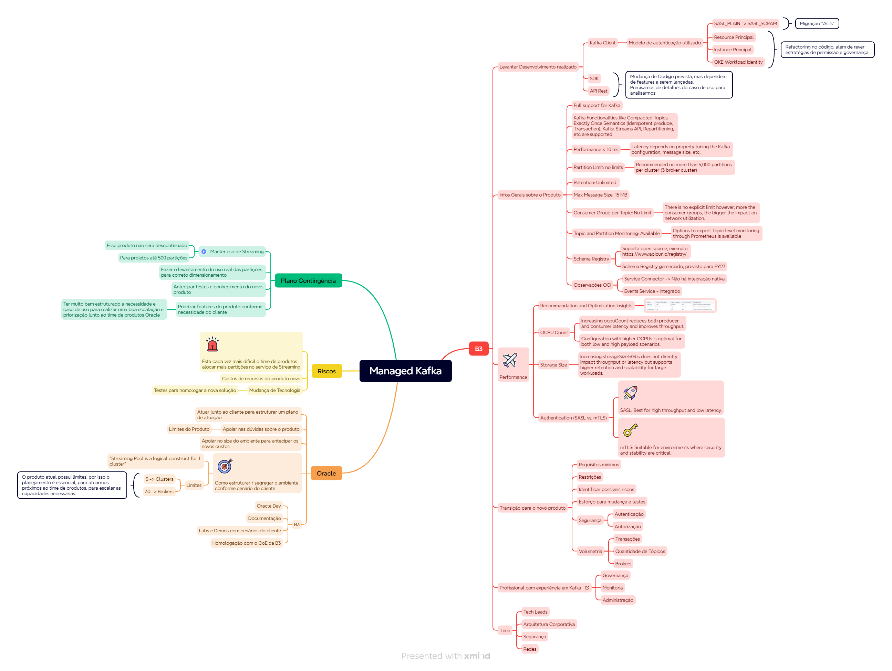

# Streaming

**Exemplos em Java para consumir e produzir mensagens com Streaming:**

Os arquivos abaixo são exemplos criados e seus arquivos de propriedades utilizados:

 - StreamingProducer.java e arquivo: streaming-producer.properties

    ```
    bootstrap.servers=cell-1.streaming.sa-saopaulo-1.oci.oraclecloud.com:9092
    security.protocol=SASL_SSL
    sasl.mechanism=PLAIN
    sasl.jaas.config=org.apache.kafka.common.security.plain.PlainLoginModule required username="tenancyName/YourDomainOrNotTestIt/username/ocid1.streampool.oc1.sa-saopaulo-1." password="yourAuthToken";
    key.serializer=org.apache.kafka.common.serialization.StringSerializer
    value.serializer=org.apache.kafka.common.serialization.StringSerializer
    #retries on transient errors and load balancing disconnections
    retries=3
    #limit request size to 1MB = 1024 x 1024
    max.request.size=1048576
    #need to set this to false, because [Idempotent production] are not yet implemented in the Streaming service
    #reference: https://docs.oracle.com/en-us/iaas/Content/Streaming/Tasks/kafkacompatibility.htm
    enable.idempotence=false
    acks=all
    ```

 - StreamingConsumer.java e streaming-consumer.properties:

    ```
    bootstrap.servers=cell-1.streaming.sa-saopaulo-1.oci.oraclecloud.com:9092
    security.protocol=SASL_SSL
    sasl.mechanism=PLAIN
    sasl.jaas.config=org.apache.kafka.common.security.plain.PlainLoginModule required username="tenancy/OracleIdentityCloudService/user/ocid1.streampool.oc1.sa-saopaulo-1." password="token";
    group.id=group-java
    enable.auto.commit=true
    auto.commit.interval.ms=1000
    session.timeout.ms=30000
    key.deserializer=org.apache.kafka.common.serialization.StringDeserializer
    value.deserializer=org.apache.kafka.common.serialization.StringDeserializer
    #limit request size to 1MB per partition = = 1024 x 1024
    max.partition.fetch.bytes=1048576
    ```

**Referências sobre Streaming:**
  - [Início Rápido do Kafka Java Client e do Serviço Streaming](https://docs.oracle.com/pt-br/iaas/Content/Streaming/Tasks/streaming-kafka-java-client-quickstart.htm#kafka-java-quickstart)


# Kafka



**Policy on behalf of Customer to Rawfka( MUST )**
```
Allow service rawfka to use vnics in compartment <compartment>
Allow service rawfka to use network-security-groups in compartment <compartment>
Allow service rawfka to use subnets in compartment <compartment>
```
 
**To enable SASL super user**
```
Allow service rawfka to {SECRET_UPDATE } in compartment <compartment>
Allow service rawfka to use secrets in compartment <compartment> where request.operation = 'UpdateSecret'
```

**Criar o arquivo kafka.json com o seguinte conteúdo, para ser utilizado na criação da configuração do cluster kafka**
```
{
    "properties": {
        "num.network.threads": 3,
        "num.io.threads": 8,
        "socket.send.buffer.bytes": 102400,
        "socket.receive.buffer.bytes": 102400,
        "socket.request.max.bytes": 104857600,
        "log.retention.hours": 168,
        "log.segment.bytes": 1073741824,
        "log.retention.check.interval.ms": 300000,
        "num.partitions": 1,
        "default.replication.factor": 1,
        "min.insync.replicas": 1,
        "message.max.bytes": 1000012,
        "replica.fetch.max.bytes": 1048576,
        "offsets.topic.replication.factor": 1,
        "transaction.state.log.replication.factor": 1,
        "transaction.state.log.min.isr": 2
    }
}
```

**Comando para criar o cluster config, baseado no arquivo gerado anteriormente**
```
oci kafka cluster-config create \
-c ocid1.compartment.oc1.xxx \
--latest-config file://kafka.json \
--region sa-vinhedo-1
```

**Criar o cluster kafka**

>Importante: a subnet para provisionar o cluster deverá ser **privada**

```
oci kafka cluster create \
--access-subnets '[{"subnets": ["ocid1.subnet.oc1.sa-vinhedo-1.xxx"]}]' \
--cluster-config-id ocid1.kafkaclusterconfig.oc1.sa-vinhedo-1.xxx \
--cluster-config-version 1 \
--cluster-type PRODUCTION \
--coordination-type ZOOKEEPER \
--broker-shape '{"nodeCount": 3, "ocpuCount": 4, "storageSizeInGbs": 100 }' \
--kafka-version 3.7.0 \
--compartment-id ocid1.compartment.oc1..xxx \
--region sa-vinhedo-1
```

**Habilitar o Super User para utilizar com SASL_SSL**

  >Primeiro deverá ser criado um vault e um secret do tipo **Manual secret generation**. Utilizar o ocid do secret, para executar o comando ou via console, clicando no botão **Update SALS SCRAM** que fica no Kafka Cluster, e associar o Vault e o Secret criado.

```
oci kafka cluster enable-superuser \
--kafka-cluster-id ocid1.kafkacluster.oc1.sa-vinhedo-1.xxx \
--compartment-id ocid1.compartment.oc1..xxx \
--secret-id ocid1.vaultsecret.oc1.sa-vinhedo-1.xxx \
--region sa-vinhedo-1
```

  >Após finalizar a execução, dentro do secret estará o usuário e senha do super user.

# Preparando os itens que serão necessário para acessar e configurar o kafka cluster após sua criação

**generate a CA key**

Gerar uma chave privada RSA protegida por senha com criptografia AES-256.
Esse comando é usado para criar uma chave privada que pode ser usada para assinar certificados digitais.
Comumente utilizado em infraestruturas de chave pública (PKI) para criar uma Autoridade Certificadora (CA).
```
openssl genpkey -algorithm RSA -out rootCA.key -aes256 -pass pass:yourpassword -pkeyopt rsa_keygen_bits:4096
```

**generate CA self signed cert:**

Esse comando cria um certificado autoassinado no formato X.509, usando a chave privada gerada anteriormente (rootCA.key). Ele é usado para configurar uma Autoridade Certificadora (CA).
Esse certificado rootCA.pem pode ser usado como Autoridade Certificadora (CA) para assinar certificados de outros servidores e dispositivos.
É útil para criar uma infraestrutura de certificação privada, por exemplo, em empresas, VPNs ou redes internas.
Pode ser instalado em clientes para que reconheçam certificados assinados por essa CA como confiáveis.
```
openssl req -x509 -new -nodes -key rootCA.key -sha256 -days 3650 -out rootCA.pem -passin pass:yourpassword
```

**create leaf cert private key and csr(cert signed request):**

Esse comando gera uma chave privada RSA de 2048 bits, chamada leaf.key, que será usada para criar um certificado "Leaf" (folha), ou seja, um certificado de entidade final.
Essa chave será usada para criar um certificado para um servidor ou cliente.
É um certificado de entidade final, ou seja, não é uma CA, mas sim um certificado assinado por uma CA (como a rootCA.pem que criamos antes).
```
openssl genpkey -algorithm RSA -out leaf.key -pkeyopt rsa_keygen_bits:2048
```

**create leaf cert csr:**

Esse comando gera uma CSR (Certificate Signing Request), que é um pedido de assinatura de certificado. 
O arquivo leaf.csr será enviado para uma Autoridade Certificadora (CA) para que ela assine e emita um certificado válido.
A CSR (leaf.csr) será enviada para uma CA (Autoridade Certificadora), que pode ser:
  - Uma CA pública como Let’s Encrypt, DigiCert, GlobalSign.
  - Uma CA privada, como a **rootCA.pem** criada anteriormente.
```
openssl req -new -key leaf.key -out leaf.csr
```

**use root CA to sign leaf cert:**

Esse comando assina a CSR (leaf.csr) usando a CA rootCA.pem, gerando um certificado final (leaf.crt). Esse certificado pode ser usado por servidores ou clientes para estabelecer conexões seguras.
O arquivo leaf.crt gerado será um certificado assinado pela sua CA **(rootCA.pem)**.
Esse certificado pode ser usado em servidores HTTPS/TLS (Apache, Nginx, etc.), autenticação de clientes, VPNs, entre outros.
```
openssl x509 -req -in leaf.csr -CA rootCA.pem -CAkey rootCA.key -CAcreateserial -out leaf.crt -days 825 -sha256 -passin pass:yourpassword
```

**Create kafka-keystore.p12 file, run the command below**

Esse comando gera um arquivo PKCS#12 (.p12) contendo a chave privada e o certificado para ser usado no Keystore do Apache Kafka.
O Apache Kafka pode usar TLS/SSL para comunicação segura entre brokers, produtores e consumidores.
O arquivo kafka-keystore.p12 é necessário para configurar o Keystore, permitindo que o Kafka use o certificado e a chave privada para autenticação e criptografia.
```
openssl pkcs12 -export -in leaf.crt -inkey leaf.key -out kafka-keystore.p12 -name kafka-key
```

**Certificado para configurar truststore.jks**

[Certificado Digicert para o jks](https://cacerts.digicert.com/DigiCertGlobalRootG2.crt.pem?_gl=1*1c1f9jy*_gcl_au*MTk2Mjc0ODc1LjE3NDA2ODAzNTM.)

**Geração da truststore.jks**

Esse comando adiciona um certificado de Autoridade Certificadora (CA) (DigiCertGlobalRootG2.crt.pem) ao Truststore (truststore.jks). 
Isso permite que o sistema reconheça certificados assinados por essa CA como confiáveis.
```
keytool -keystore truststore.jks -storepass password -alias oracle -import -file DigiCertGlobalRootG2.crt.pem
```

**Comando para atualizar o mTLS do kafka cluster com o conteúdo do arquivo rootCA.pem**
```
oci kafka cluster update \
--client-certificate-bundle "colar todo o conteúdo do arquivo rootCA.pem" \
--kafka-cluster-id ocid1.kafkacluster.oc1.sa-vinhedo-1.xxx \
--region sa-vinhedo-1
```

**Instalando o Kafka nas VM´s**
```
 cd ~
 mkdir kafka
 cd kafka
 wget https://dlcdn.apache.org/kafka/3.7.2/kafka_2.13-3.7.2.tgz
 tar -xzf kafka_2.13-3.7.2.tgz
 rm -rf kafka_2.13-3.7.2.tgz
 cd ~
 # altere o arquivo [.basrch] adicionando a linha abaixo, para colocar o kafka no path da sua VM
 export PATH=/home/opc/kafka/kafka_2.13-3.7.2/bin:$PATH
```


**SSL (mTLS) properties**

Arquivo kafkaclient.properties:

```
security.protocol=SSL
ssl.certificate.location=/home/opc/kafka/leaf.cert
ssl.key.location=/home/opc/kafka/leaf.key
ssl.keystore.password=password
ssl.keystore.location=/home/opc/kafka/kafka-keystore.p12
```


**Comandos kafka com SSL (mTLS)**
```
kafka-topics.sh --create \
  --bootstrap-server bootstrap-clstr-btaxq3z9d0ziwk0g.kafka.sa-saopaulo-1.oci.oraclecloud.com:9093 \
  --partitions 2 \
  --topic ateam-topic \
  --command-config /home/opc/kafka/kafkaclient.properties
  
kafka-console-producer.sh \
--broker-list bootstrap-clstr-btaxq3z9d0ziwk0g.kafka.sa-saopaulo-1.oci.oraclecloud.com:9093 \
--topic ateam-topic --producer.config /home/opc/kafka/kafkaclient.properties

kafka-console-consumer.sh \
--bootstrap-server bootstrap-clstr-btaxq3z9d0ziwk0g.kafka.sa-saopaulo-1.oci.oraclecloud.com:9093 \
 --topic ateam-topic --from-beginning --consumer.config /home/opc/kafka/kafkaclient.properties

kafka-topics.sh --list \
  --bootstrap-server bootstrap-clstr-btaxq3z9d0ziwk0g.kafka.sa-saopaulo-1.oci.oraclecloud.com:9093 \
  --command-config /home/opc/kafka/kafkaclient.properties
```

**Arquivos Java de Exemplo com mTLS:**

- Classe KafkaMtlsProducer.java e kafka-mtls-producer.properties:

  ```
  bootstrap.servers=bootstrap-clstr-btaxq3z9d0ziwk0g.kafka.sa-saopaulo-1.oci.oraclecloud.com:9093
  security.protocol=SSL
  ssl.certificate.location=/home/opc/kafka/leaf.cert
  ssl.key.location=/home/opc/kafka/leaf.key
  ssl.keystore.location=/home/opc/kafka/kafka-keystore.p12
  ssl.keystore.password=ateam
  key.serializer=org.apache.kafka.common.serialization.StringSerializer
  value.serializer=org.apache.kafka.common.serialization.StringSerializer
  ```

- Classe KafkaMtlsConsumer.java e kafka-mtls-consumer.properties:

  ```
  bootstrap.servers=bootstrap-clstr-btaxq3z9d0ziwk0g.kafka.sa-saopaulo-1.oci.oraclecloud.com:9093
  security.protocol=SSL
  ssl.certificate.location=/home/opc/kafka/leaf.cert
  ssl.key.location=/home/opc/kafka/leaf.key
  ssl.keystore.location=/home/opc/kafka/kafka-keystore.p12
  ssl.keystore.password=ateam
  group.id=group-mtls
  enable.auto.commit=true
  auto.commit.interval.ms=1000
  session.timeout.ms=30000
  key.deserializer=org.apache.kafka.common.serialization.StringDeserializer
  value.deserializer=org.apache.kafka.common.serialization.StringDeserializer
  ```

**SASL_SSL properties**

Arquivo kafkasasl.properties:

```
security.protocol=SASL_SSL
sasl.mechanism=SCRAM-SHA-512
ssl.truststore.location=/home/opc/kafka/truststore.jks
ssl.truststore.password=password
sasl.jaas.config=org.apache.kafka.common.security.scram.ScramLoginModule required username="superUserName" password="password";
```

**Arquivos Java de Exemplo com SASL_SSL:**

- Classe KafkaSASL_SSLProducer.java e kafka-sasl-ssl-consumer.properties:

  ```
  bootstrap.servers=bootstrap-clstr-btaxq3z9d0ziwk0g.kafka.sa-saopaulo-1.oci.oraclecloud.com:9092
  security.protocol=SASL_SSL
  sasl.mechanism=SCRAM-SHA-512
  ssl.truststore.location=/home/opc/kafka/truststore.jks
  ssl.truststore.password=ateam
  sasl.jaas.config=org.apache.kafka.common.security.scram.ScramLoginModule required username="super-user" password="senha";
  key.serializer=org.apache.kafka.common.serialization.StringSerializer
  value.serializer=org.apache.kafka.common.serialization.StringSerializer
  ```

- Classe KafkaSASL_SSLConsumer.java e kafka-sasl-ssl-consumer.properties:

  ```
  bootstrap.servers=bootstrap-clstr-btaxq3z9d0ziwk0g.kafka.sa-saopaulo-1.oci.oraclecloud.com:9092
  security.protocol=SASL_SSL
  sasl.mechanism=SCRAM-SHA-512
  ssl.truststore.location=/home/opc/kafka/truststore.jks
  ssl.truststore.password=ateam
  sasl.jaas.config=org.apache.kafka.common.security.scram.ScramLoginModule required username="super-user" password="senha";
  group.id=group-sals-ssl
  enable.auto.commit=true
  auto.commit.interval.ms=1000
  session.timeout.ms=30000
  key.deserializer=org.apache.kafka.common.serialization.StringDeserializer
  value.deserializer=org.apache.kafka.common.serialization.StringDeserializer
  ```

**Comando kafka com SASL_SSL**

```
kafka-broker-api-versions.sh --bootstrap-server bootstrap-clstr-btaxq3z9d0ziwk0g.kafka.sa-saopaulo-1.oci.oraclecloud.com:9092 --command-config kafkasasl.properties
```
**Usando Super User para criar novo usuário**
```
kafka-configs.sh --bootstrap-server bootstrap-clstr-btaxq3z9d0ziwk0g.kafka.sa-saopaulo-1.oci.oraclecloud.com:9092 \
  --alter --add-config "SCRAM-SHA-512=[password=ateam2025]" \
  --entity-type users --entity-name ateamUser \
  --command-config kafkasasl.properties
  
kafka-acls.sh --bootstrap-server bootstrap-clstr-btaxq3z9d0ziwk0g.kafka.sa-saopaulo-1.oci.oraclecloud.com:9092 \
  --add --allow-principal User:ateamUser \
  --operation Read --operation Write --operation Describe \
  --topic ateam-topic \
  --command-config kafkasasl.properties
  
kafka-acls.sh --bootstrap-server bootstrap-clstr-btaxq3z9d0ziwk0g.kafka.sa-saopaulo-1.oci.oraclecloud.com:9092 \
  --add --allow-principal User:ateamUser \
  --operation Read --operation Describe --group group-0 \
  --command-config kafkasasl.properties

```
**Links sobre ACLs**
- [Manage Access Control Lists (ACLs) for Authorization in Confluent Platform](https://docs.confluent.io/platform/current/security/authorization/acls/manage-acls.html)

- [Authorization and ACLs - Kafka](https://kafka.apache.org/documentation/#security_authz)

- [User authentication and authorization in Apache Kafka](https://developer.ibm.com/tutorials/kafka-authn-authz/)

**Testes com Interface Gráfica com o Kafka**

Utilizamos o [kafka-ui](https://github.com/provectus/kafka-ui)

Rodamos o comando abaixo na VM:
```
docker run -it -p 8080:8080 -e DYNAMIC_CONFIG_ENABLED=true provectuslabs/kafka-ui
```

Depois esse comando para criar um túnel e possibilitar a comunicação usando o navegador local
```
ssh opc@ipVM -i /pathChavePrivada/ssh-key.key -A -L 8080:localhost:8080
```

Existe outra opção de UI, a [akhq.io](https://akhq.io/), que não testamos porque seu arquivo de configuração era bem complexo.

## Testes com Mirror Maker 2.0
>Replicação de mensagens entre diferentes regiões OCI

**Setup de Network**

Antes de iniciar, precisamos preparar a conectividade entre as regiões, conforme previsto na imagem:


  - Definir quais regiões estarão envolvidas na arquitetura e definir os CIDR das VCN´s, para que não haja Overlap de IP´s;
  - Definir a região Primária e a região de Stand-By;
    >**Importante**: o Mirror Maker será executado na região *Stand-By*;
  - Neste exemplo, vamos utilizar GRU como primária (Source) e VCP como Stand-By (Target)
  - Na console OCI, primeiro cria-se o DRG (Dynamic routing gateway) em ambas as regiões, e associa cada um como attchment nas VCN´s que estão os recursos;
  - Agora precisamos criar *Remote peering connection attachments* para cada DRG e novamente em ambas as regiões;
  - Agora na região Stand-By, clique no *Remote peering connection attachments* criado, para abrir uma tela para estabeler a conexão com a região primária;
  - Nesta tela (ainda na região Stand-By), você precisará escolher a região primária e informar o OCID do Remote peering connect attachment  também da região primária, e clicar em estabelecer a conexão. Esse procedimento demora alguns minutos e será aplicado nas duas regiões envolvidas.
  - Em ambas as regiões, deve-se :
    - configurar o route table das subnets com o DRG usando CIDR da VCN da outra região;
    - configurar regras de Security List usando o CIDR da VCN da outra região;

**Algumas imagens para ilustrar as configurações realizadas em Networking:**

Networking >> Virtual cloud networks >> Sua VCN >> Clique no link do DNS Resolver >> Private resolver details:

>GRU

  
  

>VCP

  
  

Configurar as route tables utilizadas nas subnets para permitir o acesso via DRG para a outra região (usamos o CIDR da VCN da outra região):

>GRU

  

>VCP

  

Configurar as Security List em Ingress Rules das subnets, para liberar a conectividade entre as regiões (usamos o CIDR da VCN da outra região):

>GRU

  

>VCP

  

Referências:

- [Oracle Cloud Infrastructure (OCI) Remote Peering - how to peer two subnets in two separate regions](https://www.youtube.com/watch?v=mgYieeS10dI)

- [OCI Private DNS - Common Scenarios](https://www.ateam-oracle.com/post/oci-private-dns---common-scenarios)

**Usando o Mirror Maker**

Arquivo de configuração - mirror-maker.properties:

```
# specify any number of cluster aliases
clusters = source, destination

# connection information for each cluster
# This is a comma separated host:port pairs for each cluster
# for example. "A_host1:9092, A_host2:9092, A_host3:9092"  and you can see the exact host name on Ambari > Hosts
source.bootstrap.servers = bootstrap-clstr-btaxq3z9d0ziwk0g.kafka.sa-saopaulo-1.oci.oraclecloud.com:9092
destination.bootstrap.servers = bootstrap-clstr-przl6vo6drynch0h.kafka.sa-vinhedo-1.oci.oraclecloud.com:9092

# enable and configure individual replication flows
source->destination.enabled = true

#security setup
source.security.protocol=SASL_SSL
source.sasl.mechanism=SCRAM-SHA-512
source.ssl.truststore.location=/home/opc/kafka/truststore.jks
source.ssl.truststore.password=ateam
source.sasl.jaas.config=org.apache.kafka.common.security.scram.ScramLoginModule required username="super-user" password="senha";

destination.security.protocol=SASL_SSL
destination.sasl.mechanism=SCRAM-SHA-512
destination.ssl.truststore.location=/home/opc/kafka/truststore.jks
destination.ssl.truststore.password=ateam
destination.sasl.jaas.config=org.apache.kafka.common.security.scram.ScramLoginModule required username="super-user" password="senha";

# regex which defines which topics gets replicated. For eg "foo-.*"
source->destination.topics = ateam-topic
groups=.*
topics.blacklist="*.internal,__.*"

# Setting replication factor of newly created remote topics
replication.factor=3

replication.policy.class=org.apache.kafka.connect.mirror.IdentityReplicationPolicy

checkpoints.topic.replication.factor=1
heartbeats.topic.replication.factor=1
offset-syncs.topic.replication.factor=1

offset.storage.replication.factor=1
status.storage.replication.factor=1
config.storage.replication.factor=1
```

Comando para executar o Mirror:
>Esse arquivo já está na instalação do kafka quando o mesmo foi baixado e instalado na VM

```
connect-mirror-maker.sh mirror-maker.properties
```

Referências:

- [Como usar o Kafka MirrorMaker 2.0 na migração e replicação de dados e nos casos de uso](https://learn.microsoft.com/pt-br/azure/hdinsight/kafka/kafka-mirrormaker-2-0-guide)


**Testes com Schema Registry e artefatos Avro**

Estamos usando o [Apicurio Registry](https://www.apicur.io/registry/), resumindo, foram dois comandos para executar o schema registry:
  >Estamos executando dentro de uma VM que possui acesso ao ambiente Kafka criado

  ```
  docker run -it -p 8080:8080 apicurio/apicurio-registry:3.0.6
  docker run -it -p 8888:8080 apicurio/apicurio-registry-ui:3.0.6
  ```

Depois de instalar na VM, foi necessário criar um túnel para as portas do backend e frontend, para conseguir executar localmente a ui:

```
ssh opc@ipSuaVm -i /pathChavePrivada/ssh-key-2024-11-01.key -A -L :8888:localhost:8888 8080:localhost:8080
```

Criamos um arquivo Avro: user.avsc
  ```
  {
    "type": "record",
    "name": "User",
    "namespace": "com.oracle.avro",
    "fields": [
      {"name": "id", "type": "int"},
      {"name": "name", "type": "string"},
      {"name": "email", "type": "string"}
    ]
  }
  ```
Utilizamos o um plugin no maven (arquivo pom.xml) para gerar uma classe Java baseada neste arquivo Avro:

  ```
  <dependencies>   
    <!-- Kafka Client -->
    <dependency>
        <groupId>org.apache.kafka</groupId>
        <artifactId>kafka-clients</artifactId>
        <version>3.9.0</version>
    </dependency>

    <!-- Avro -->
    <dependency>
        <groupId>org.apache.avro</groupId>
        <artifactId>avro</artifactId>
        <version>1.12.0</version>
    </dependency>  

    <!-- Kafka Avro Serializer -->
    <dependency>
        <groupId>io.confluent</groupId>
        <artifactId>kafka-avro-serializer</artifactId>
        <version>7.9.0</version>
    </dependency>      

    <!-- Apicurio -->
    <dependency>
      <groupId>io.apicurio</groupId>
      <artifactId>apicurio-registry-avro-serde-kafka</artifactId>
      <version>3.0.6</version>
    </dependency>    
  </dependencies>

   <!-- Build Java Class from Avro file -->
  <build>
    <plugins>
        <plugin>
            <groupId>org.apache.avro</groupId>
            <artifactId>avro-maven-plugin</artifactId>
            <version>1.11.0</version>
            <executions>
                <execution>
                    <phase>generate-sources</phase>
                    <goals>
                        <goal>schema</goal>
                    </goals>
                    <configuration>
                        <sourceDirectory>${project.basedir}/src/main/avro</sourceDirectory>
                        <outputDirectory>${project.basedir}/src/main/java</outputDirectory>
                    </configuration>
                </execution>
            </executions>
        </plugin>      
      </plugins>
  </build>
  ```
Para gerar a classe Java através do arquivo Avro, executar a linha de comando:
  
  ```
  mvn org.apache.avro:avro-maven-plugin:schema
  ou
  mvn compile -f "/home/opc/projeto/kafka/pom.xml"
  ```

Criamos as classes abaixo para trabalharmos com Avro e conectar no Schema Registry Apicurio, e listamos os pontos que consideramos mais relevantes para sua atenção:

  - KafkaSASL_SSL_AvroProducer.java

      ```
      import org.apache.kafka.clients.producer.KafkaProducer;
      import org.apache.kafka.clients.producer.ProducerConfig;
      import org.apache.kafka.clients.producer.ProducerRecord;
      import org.apache.kafka.common.serialization.StringSerializer;

      import com.oracle.avro.User;
      import com.oracle.util.Environments;
      import com.oracle.util.PropertiesUtil;

      import io.apicurio.registry.serde.avro.AvroKafkaSerializer;
      import io.apicurio.registry.serde.config.SerdeConfig;

      ...

      Properties properties = PropertiesUtil.loadProperties(Environments.KAFKA_SASL_SSL_AVRO_PRODUCER);

      properties.put(ProducerConfig.KEY_SERIALIZER_CLASS_CONFIG, StringSerializer.class.getName());
      //utilizando a classe para serializar do schema registry utilizado
      properties.put(ProducerConfig.VALUE_SERIALIZER_CLASS_CONFIG, AvroKafkaSerializer.class.getName());

      //endpoint do schema registry
      String registryUrl = "http://localhost:8080/apis/registry/v3";
      properties.put(SerdeConfig.REGISTRY_URL, registryUrl);
      
      //auto-registrar o schema no schema registry
      properties.put(SerdeConfig.AUTO_REGISTER_ARTIFACT, Boolean.TRUE);
      ```

  - kafka-sasl-ssl-avro-producer.properties

    ```
    bootstrap.servers=bootstrap-clstr-btaxq3z9d0ziwk0g.kafka.sa-saopaulo-1.oci.oraclecloud.com:9092
    security.protocol=SASL_SSL
    sasl.mechanism=SCRAM-SHA-512
    ssl.truststore.location=/home/opc/kafka/truststore.jks
    ssl.truststore.password=ateam
    sasl.jaas.config=org.apache.kafka.common.security.scram.ScramLoginModule required username="super-user" password="senha";
    #aqui as informações para serializar a chave e valor para a mensagem estão dentro da própria classe
    #url do schema registry também está definido na classe
    ```

  - KafkaSASL_SSL_AvroConsumer.java

      ```
      import org.apache.kafka.clients.consumer.ConsumerRecord;
      import org.apache.kafka.clients.consumer.ConsumerRecords;
      import org.apache.kafka.clients.consumer.KafkaConsumer;
      import org.apache.kafka.common.serialization.StringDeserializer;

      import com.oracle.avro.User;
      import com.oracle.util.Environments;
      import com.oracle.util.PropertiesUtil;

      import io.apicurio.registry.serde.avro.AvroKafkaDeserializer;
      import io.apicurio.registry.serde.config.SerdeConfig;

      ...

      Properties properties = PropertiesUtil.loadProperties(Environments.KAFKA_SASL_SSL_AVRO_CONSUMER);
      properties.put("key.deserializer", StringDeserializer.class.getName());
      //utilizando a classe para deserializar do schema registry utilizado
      properties.put("value.deserializer", AvroKafkaDeserializer.class.getName());
      
      String registryUrl = "http://localhost:8080/apis/registry/v3";
      properties.put(SerdeConfig.REGISTRY_URL, registryUrl);
      ```
  
  - kafka-sasl-ssl-avro-consumer.properties

    ```
    bootstrap.servers=bootstrap-clstr-btaxq3z9d0ziwk0g.kafka.sa-saopaulo-1.oci.oraclecloud.com:9092
    security.protocol=SASL_SSL
    sasl.mechanism=SCRAM-SHA-512
    ssl.truststore.location=/home/opc/kafka/truststore.jks
    ssl.truststore.password=ateam
    sasl.jaas.config=org.apache.kafka.common.security.scram.ScramLoginModule required username="super-user" password="senha";
    group.id=group-avro-consumer
    enable.auto.commit=true
    auto.commit.interval.ms=1000
    session.timeout.ms=30000
    ```

Ao executar a classe para produzir a mensagem, podemos observar o artefato criado no schema registry, lembrando que o link para a interface web é http://localhost:8888/:

  

Acessar o artefato criado, aba Versions e clicar na versão existente, conseguimos verificar o conteúdo do arquivo Avro criado no Schema Registry:

  

Referências sobre Schema Registry:

- [Exemplos de código com Apicurio](https://github.com/Apicurio/apicurio-registry/blob/main/examples/simple-avro)

- [Karapace, uma outra opção para Schema Registry](https://www.karapace.io/)

- [Exemplos de código com Karapace](https://instaclustr.medium.com/exploring-karapace-the-open-source-schema-registry-for-apache-kafka-part-1-apache-avro-3a7d09fcb4a8)

# Tasks

- **Geral**
  - [x] Remover conteúdo sensível, usando arquivo de propriedades
  - [x] Rever boas práticas, como armazenar os artefatos de segurança em vault ou bucket

- **Streaming**
  - [x] Produtor e Consumidor Streaming
  - [x] Depois que configurei para usar versões mais recentes das bibliotecas kafka no projeto, foi necessário definir o parâmetro [enable.idempotence=false] nas propriedades da classe que produz as mensagens, pois estava ocorrendo o erro: *org.apache.kafka.common.errors.UnsupportedVersionException: The broker does not support INIT_PRODUCER_ID*

- **Kafka**
  - [x] Produtor e Consumidor SASL-SCRAM
  - [x] Produtor e Consumidor mTLS
  - [x] Utilizar super user do Kafka e criação de ACL´s (filas, usuários e permissões entre os artefatos)
  - [x] Plugar uma interface gráfica para administrar o ambiente
  - [x] Testes com Mirror Maker
  - [x] Schema Registry ainda não nativo, mas podemos utilizar um open source (neste caso, usamos o Apicurio). Schema Registry gerenciado está no roadmap para FY27.
  - [x] O uso do FQDN do servidor Kafka é obrigatório para conexão
    - Esse é o erro quando tentamos utilizar o IP do servidor via mTLS: *ERROR: [Producer clientId=producer-1] Connection to node -1 (/10.0.1.238:9093) failed authentication due to: SSL handshake failed*
    - Esse é o erro quando tentamos usar o IP do servidor via SASL-SSL: *ERROR: [Producer clientId=producer-1] Connection to node -1 (private-nlb-c1-btaxq3z9d0ziwk0g.sub11252107191.kafkagru.oraclevcn.com/10.0.1.238:9092) failed authentication due to: SSL handshake failed*
  - [ ] Descrever itens de segurança com mais detalhes, principalmente sobre o uso de mTLS e serviços Oracle OCI como CA (autoridade certificadora para uso privado de certificados), como recomendação para ambientes produtivos


## Acknowledgments

**Author** 
- Rodrigo Chafik Choueiri (Oracle LAD A-Team Solution Engineer)  

**Contributors** 
- Joao Tarla (Oracle LAD A-Team Solution Engineer)
- Sillas Lima (Oracle LAD Solution Architect) 
- Luciana Oliveira (Oracle LAD A-Team Networking Specialist)
- Rodrigo Pace de Barros (Oracle LAD A-Team Security Specialist)
- John Moore (Consulting Member of Technical Staff)
- Abhishek Bhaumik (Product Manager)
